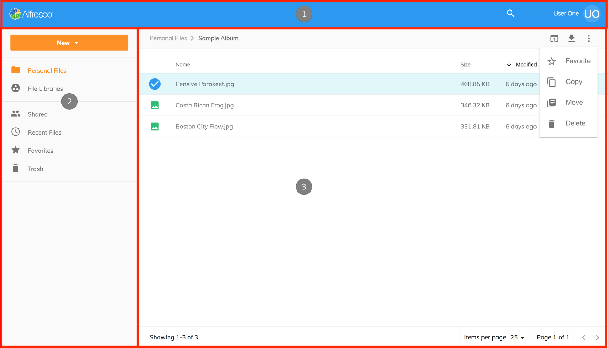
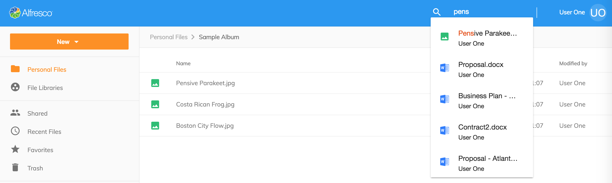

# Alfresco Example Content Application

<!-- markdownlint-disable MD033 -->

## Introduction

The Alfresco Content Application is an example application built using
[Alfresco Application Development Framework (ADF)](https://github.com/Alfresco/alfresco-ng2-components) components.

### Who is this example application for

This example application demonstrates to Angular software engineers
how to construct a content application using the Alfresco ADF.

This example application represents a meaningful composition of ADF components that provide end users
with a simple and easy to use interface for working with files stored in the Alfresco Content Services repository.

### Prerequisites

This application was created based on the latest releases from Alfresco:

- [Alfresco ADF (2.5.0)](https://community.alfresco.com/community/application-development-framework/pages/get-started)
- [Alfresco Content Services (6.0.0)](https://www.alfresco.com/platform/content-services-ecm)
  or [Alfresco Community Edition (6.0 - General Release: 201806)](https://www.alfresco.com/products/community/download)

<p class="warning">
You also need <a href="https://nodejs.org/en/" target="_blank">node.js</a> (LTS) installed to build it locally from source code.
</p>

The latest version of the Alfresco Content platform is required
due to the application using the latest [REST APIs](https://docs.alfresco.com/5.2/pra/1/topics/pra-welcome.html) developments.

## Features

The concept of this example is a simple user interface which makes accessing files in the Alfresco Content Services repository easy.

Often Content Management systems provide more capabilities out of the box than most users need;
providing too many capabilities to these users prevents them from working efficiently,
so they may end up using unsanctioned file management solutions which presents a proliferation of content storage
and collaboration solutions as well as compliance issues for organizations.

This application demonstrates how the complexity of Content Management can be simplified
using the Alfresco Application Development Framework to easily and quickly create custom solutions for specific user cases.

### User Interface - layout

There are three main areas of the application controlled by the [Layout component](https://github.com/Alfresco/alfresco-content-app/tree/master/src/app/components/layout):

- [(1) Application Header](#header)
- [(2) Side Navigation](#side-navigation)
- [(3) Document List](#document-list-layout)



### Header

The application [header](https://github.com/Alfresco/alfresco-content-app/tree/master/src/app/components/header) has three main elements.

1. [Logo and Color](#logo-and-color)
2. [Search](#search)
3. [Current User](#current-user)


#### Logo and Color

Logo & app primary color - logo and color are configurable by updating the
[app.config.json](https://github.com/Alfresco/alfresco-content-app/blob/master/src/app.config.json) file in the root folder of the project.
Please refer to the [Application Configuration](/getting-started#application-logo) documentation for more information on how to change the logo and color.

#### Search

The application [Search](https://github.com/Alfresco/alfresco-content-app/tree/master/src/app/components/search) -
uses the [ADF Search Component](https://github.com/Alfresco/alfresco-ng2-components/tree/master/lib/content-services/search)
the app provides a 'live' search feature, where users can open files and folders directly from the Search API results.



If you type `Enter` in the text input area, you are going to see [Search Results](#search-results) page
with advanced filtering and faceted search.

#### Current User

[Current User](https://github.com/Alfresco/alfresco-content-app/tree/development/src/app/components/current-user) -
displays the user's name, and a menu where users can logout.
Optionally through updating the [app.config.json](https://github.com/Alfresco/alfresco-content-app/blob/master/src/app.config.json)
a language switching menu can be displayed.


### Side Navigation

The application [side navigation](https://github.com/Alfresco/alfresco-content-app/tree/master/src/app/components/sidenav) has two features:
a button menu and navigation links.


#### New button

The New button displays a menu which provides three actions:

- Create a new folder - provides a dialog which allows the creation of a new folder, the folder name is mandatory and the description is optional.
- Upload a file - invokes the operating system file browser and allows a user to select file(s) to upload into their current location in the content repository.
- Upload a folder - invokes the operating system folder browser and allows a user to select a folder to upload to their current location in the content repository.

When an upload starts the [upload component](https://github.com/Alfresco/alfresco-ng2-components/tree/master/lib/content-services/upload)
is displayed which shows the user the progress of the uploads they have started.
The upload dialog persists on the screen and can be minimized; users are able to continue using the application whilst uploads are in progress
and uploads can be canceled which will stop uploads in progress or permanently delete already completed uploads.


#### Navigation

The navigation links are configurable via the [app.config.json](https://github.com/Alfresco/alfresco-content-app/blob/master/src/app.config.json).
Default configuration creates two sections.
See [Navigation](/getting-started#navigation) for more information about configuring the side navigation.

### Document List Layout

The main area of the application is composed of several individual ADF components:

- (1) [Breadcrumb](https://alfresco.github.io/adf-component-catalog/components/BreadcrumbComponent.html)
- (2) [Toolbar](https://alfresco.github.io/adf-component-catalog/components/ToolbarComponent.html)
- (3) [Document List](https://alfresco.github.io/adf-component-catalog/components/DocumentListComponent.html)
- (4) [Pagination](https://alfresco.github.io/adf-component-catalog/components/PaginationComponent.html)


The application has seven different Document List views which share commonalities between each view and subtle differences depending on the content being loaded which are explained below.

#### Personal Files

Personal Files retrieves all content from the logged in user's home area (`/User Homes/<username>/`) in the repository;
if the user is ‘admin’ who does not have a home folder then the repository root folder is shown.

Personal Files is the [Files](https://github.com/Alfresco/alfresco-content-app/tree/master/src/app/components/files) component,
using the [Nodes API](https://api-explorer.alfresco.com/api-explorer/#/nodes).

#### File Libraries

File Libraries retrieves all the sites that the user is a member of including what type of site it is: public, moderated or private.
File Libraries is the [Libraries](https://github.com/Alfresco/alfresco-content-app/tree/master/src/app/components/libraries) component,
using the [Sites API](https://api-explorer.alfresco.com/api-explorer/#/sites).

When a user opens one of their sites then the content for the site's document library is shown.
To display the files and folders from a site (`/Sites/<siteid>/Document Library/`) the [Files](https://github.com/Alfresco/alfresco-content-app/tree/master/src/app/components/files) component,
using the [Nodes API](https://api-explorer.alfresco.com/api-explorer/#/nodes) is used.

#### Shared Files

The Shared Files view aggregates all files that have been shared using the QuickShare feature in the content repository.
The [Shared Files](https://github.com/Alfresco/alfresco-content-app/tree/master/src/app/components/shared-files) component uses the [shared-links API](https://api-explorer.alfresco.com/api-explorer/#/shared-links)
and includes extra columns to display where the file is
[located](https://github.com/Alfresco/alfresco-content-app/tree/master/src/app/components/location-link)
in the content repository and who created the shared link.

A feature for creating and removing Shared Links will be added in the future.

#### Recent Files

The Recent Files view shows all the files that have been created or modified within the last 30 days by the current user.
The [Recent Files](https://github.com/Alfresco/alfresco-content-app/tree/master/src/app/components/recent-files)
component uses the Search API to query SOLR for changes made by the user and includes an extra column to display where the file is
[located](https://github.com/Alfresco/alfresco-content-app/tree/master/src/app/components/location-link)
in the content repository.

#### Favorites

The Favorites view shows all files and folders from the content repository that have been marked as a favorite by the current user.
The [Favorites](https://github.com/Alfresco/alfresco-content-app/tree/master/src/app/components/favorites) component uses the
[favorites](https://api-explorer.alfresco.com/api-explorer/#/favorites) API to retrieve all the favorite nodes for the user
and includes an extra column to display where the file is
[located](https://github.com/Alfresco/alfresco-content-app/tree/master/src/app/components/location-link)
in the content repository.

#### Trash

The Trash view shows all the items that a user has deleted, admin will see items deleted by all users.
The actions available in this view are Restore and Permanently Delete.
The [Trashcan](https://github.com/Alfresco/alfresco-content-app/tree/master/src/app/components/trashcan) component uses the
[trashcan](https://api-explorer.alfresco.com/api-explorer/#/trashcan) API to retrieve the deleted items
and perform the actions requested by the user and includes an extra column to display where the item was
[located](https://github.com/Alfresco/alfresco-content-app/tree/master/src/app/components/location-link)
in the content repository before it was deleted.

#### Search Results

The Search Results view shows the found items for a search query. It has a custom layout template and users can easily browse the results and perform actions on items.
For more information on the [SearchComponent](https://github.com/Alfresco/alfresco-content-app/tree/master/src/app/components/search), please also check this [Search Results](#search-results1) section.

#### Actions and the Actions Toolbar

All the views incorporate the [toolbar](https://alfresco.github.io/adf-component-catalog/components/ToolbarComponent.html)
component from the Alfresco Application Development Framework. 

Actions are displayed in the toolbar when item(s) are selected, or a right click is performed; apart from the Trash view they all display the following actions when the current user has the necessary permissions,
actions are automatically hidden when the user does not have permission.

<table>
<thead>
    <th>Action</th>
    <th>File</th>
    <th>Folder</th>
</thead>
<tbody>
    <tr>
        <td>View</td>
        <td>
            Opens the selected file using the <a href="https://github.com/Alfresco/alfresco-content-app/tree/master/src/app/components/preview" target="_blank">Preview</a> component,
            where the file cannot be displayed natively in a browser a PDF rendition is obtained from the repository.
        </td>
        <td>Not applicable</td>
    </tr>
    <tr>
        <td>Download</td>
        <td>Downloads single files to the user's computer, when multiple files are selected they are compressed into a ZIP and then downloaded.</td>
        <td>Folders are automatically compressed into a ZIP and then downloaded to the user's computer.</td>
    </tr>
    <tr>
        <td>Edit</td>
        <td>Not applicable</td>
        <td>The folder name and description can be edited in a dialog.</td>
    </tr>
    <tr>
        <td>Favorite</td>
        <td colspan="2">
            Toggle the favorite mark on or off for files and folders, when multiple items are selected
            and one or more are not favorites then the mark will be toggled on.
        </td>
    </tr>
    <tr>
        <td>Copy</td>
        <td colspan="2">
            Files and folders can be copied to another location in the content repository using the
            <a href="https://alfresco.github.io/adf-component-catalog/components/ContentNodeSelectorComponent.html" target="_blank">content-node-selector</a> component;
            once the copy action has completed the user is notified and can undo the action (which permanently deletes the created copies).
        </td>
    </tr>
    <tr>
        <td>Move</td>
        <td colspan="2">
            Files and folders can be moved to another location in the content repository using the
            <a href="https://alfresco.github.io/adf-component-catalog/components/ContentNodeSelectorComponent.html" target="_blank">content-node-selector</a> component;
            once the move action has completed the user is notified and can undo the action (which moves the items back to the original location).
        </td>
    </tr>
    <tr>
        <td>Share</td>
        <td>
            Create and copy a link to a file that can be shared, the links are accessible without granting permissions to the file, and do not require users to login to the application. 
        </td>
        <td>
            Not applicable.
        </td>
    </tr>
    <tr>
        <td>Delete</td>
        <td colspan="2">
            Files and folders can be deleted from their location in the content repository;
            once the delete action has completed the user is notified and can undo the action (which restores the items from the trash).
        </td>
    </tr>
    <tr>
        <td>Manage Versions</td>
        <td>
            Versions of files can be viewed, uploaded, restored, downloaded and deleted by using the version manager dialog;
            once each action has completed the list of versions is updated according to the change.
        </td>
        <td>Not applicable</td>
    </tr>
     <tr>
        <td>Permissions</td>
        <td>
            Permissions on a file can be adjusted as required in a number of ways; disable inheritance from the parent folder, change a user or groups role and grant users/groups access.
        </td>
        <td>Not available</td>
    </tr>
</tbody>
</table>

Besides the actions available in the toolbar users can
* single click on a file to view it, and a folder to open it
* single click an item to select it
* double click on a file to view it, and a folder to open it

### File Viewer

The File Viewer has been created using the [ViewerComponent](https://alfresco.github.io/adf-component-catalog/components/ViewerComponent.html) from the ADF. The Viewer has four main areas:


1. [Header & Toolbar](#header-and-toolbar)
2. [Content](#content)
3. [Thumbnails side pane](#thumbnails-side-pane)
4. [Viewer Controls](#viewer-controls)

#### Header and Toolbar

The Header & Toolbar section of the viewer contains a number of features that relate to the file currently being displayed:

- Close 'X' will return the user to the folder that contains the file.
- The name and file type icon is shown in the middle.
- Next and previous buttons will be displayed either side of the file name so that users can navigate to other files in the folder without navigating away from the viewer.
- Finally, on the right hand side an actions toolbar provides users with the ability to download, favorite, move, copy, delete, manage versions and view info panel.

#### Content

The File Viewer consists of four separate views that handle displaying the content based on four types of content, covering various [file/mime](https://alfresco.github.io/adf-component-catalog/components/ViewerComponent.html#supported-file-formats) types:

- Document View: PDF files are displayed in the application File Viewer, for other document types (DOCX etc) then a PDF rendition is automatically retrieved.
- Image View: JPEG, PNG, GIF, BMP and SVG images are natively displayed in the application File Viewer.
- Media View: MP4, MP3, WAV, OGG and WEBM files are played natively application File Viewer. The File Viewer will download, by default, 50MB of the content at a time to ensure a smooth playback of the content.
- Text View: TXT, XML, JS, HTML, JSON and TS files are natively displayed as text in the application File Viewer.

#### Thumbnails side pane

The Document View includes a thumbnails pane which can be activated by a button in the Viewer Actions toolbar. Clicking on a thumbnail will take a user directly to the selected page and as users scroll through a document the current page is highlighted in the pane.

#### Viewer Controls

At the bottom of the content the Viewer Controls allow users to interact with the content in various ways; the actions available are dependant on the type of content being displayed.

- Document View:
  - Activate/Deactivate thumbnails pane
  - Previous/Next page
  - Jump to page number
  - Zoom in/out
  - Fit to page
  - Print
- Image View:
  - Zoom in/out
  - Rotate left/right (does not alter content in the repository)
  - Reset image
  - Print
- Media View:
  - Play/pause
  - Timeline position
  - Toggle audio
  - Audio volume
  - Full screen

### Info Drawer

The Info Drawer displays node information in the right sidebar panel. It is created by using the [InfoDrawerComponent](https://alfresco.github.io/adf-component-catalog/components/InfoDrawerComponent.html). This info is available for both folder and file nodes.

Currently, there are 2 tabs available: Properties and Versions.

#### Properties tab

The Properties tab displays the node's metadata info by using the [ContentMetadataCardComponent](https://alfresco.github.io/adf-component-catalog/components/ContentMetadataCardComponent.html).


For more information, please check also the [ContentMetadataComponent](https://alfresco.github.io/adf-component-catalog/components/ContentMetadataComponent.html).

#### Comments tab

The Comments tab displays all comments made on the selected node in the respoistory by using the [CommentsComponent](https://alfresco.github.io/adf-component-catalog/components/CommentsComponent.html).  Users can post new comments that will be displayed immediately.

### Version Manager

The versions of a file can be viewed & managed by using the [VersionManagerComponent](https://alfresco.github.io/adf-component-catalog/components/VersionManagerComponent.html).

There are 2 ways users can access the Version Manager:

1) From the 'Manage Versions' option of the 'More actions' menu (check [Actions and the Actions Toolbar](#actions-and-the-actions-toolbar)):


2) From the [Info Drawer](#info-drawer) (the Details right panel):


#### Upload new version

A new version for the selected file can be added by using this button. Users can upload a new file version using a file that is does not have the same name, or mime type as the current version, whilst allowing the user to choose the type of version (minor or major) and inputting supporting comments.

Please also check the [UploadVersionButtonComponent](https://alfresco.github.io/adf-component-catalog/components/UploadVersionButtonComponent.html).

#### Actions Menu

Each item in the version list has a couple of actions available: Restore, Download and Delete. These are displayed if user has permission to do that specific action. The 'Download' and 'Delete' can be also disabled from the app.config.

In the app.config.json file, these are the current settings for the ACA version manager:

```json
{
   "adf-version-manager": {
       "allowComments": true,
       "allowDownload": true
   }
}
```

Set the allowComments to false if the version comments should not be displayed on the version list.

Clicking to delete a version of a file triggers a confirmation dialog. Please see the [ConfirmDialogComponent](https://alfresco.github.io/adf-component-catalog/components/ConfirmDialogComponent.html) for more info.

### Search Results

Once you type the text in the Search Input component and press `Enter` you are going to see the Search Results page


This page consists of the following ADF components:

- [Search Filter](https://github.com/Alfresco/alfresco-ng2-components/blob/master/docs/content-services/search-filter.component.md)
- [Search Chip List](https://github.com/Alfresco/alfresco-ng2-components/blob/master/docs/content-services/search-chip-list.component.md)
- [Search Sorting Picker](https://github.com/Alfresco/alfresco-ng2-components/blob/master/docs/content-services/search-sorting-picker.component.md)
- [Document List](https://github.com/Alfresco/alfresco-ng2-components/blob/master/docs/content-services/document-list.component.md) with custom layout template
- [Info Drawer](#info-drawer) with Metadata and [Version Management](#version-manager)
- [Toolbar with basic actions](#actions-and-the-actions-toolbar) like `Preview`, `Download`, `Favorite`, `Copy`, etc.

And also the Info Drawer, Toolbar and Node Selector dialogs for copy and move operations.

## How to contribute

Want to file a bug, contribute some code, or improve documentation? Excellent!
Read up on our guidelines for [contributing][contributing]
and then check out one of our issues in the [Jira][jira] or [GitHub][github]

### How long will it take for my contribution to be reviewed

The time necessary for a code review will vary, smaller changes may be reviewed within days, while larger changes may take longer.

[contributing]: https://github.com/Alfresco/alfresco-content-app/blob/master/CONTRIBUTING.md
[github]: https://github.com/Alfresco/alfresco-content-app/issues
[jira]: https://issues.alfresco.com/jira/projects/ACA
