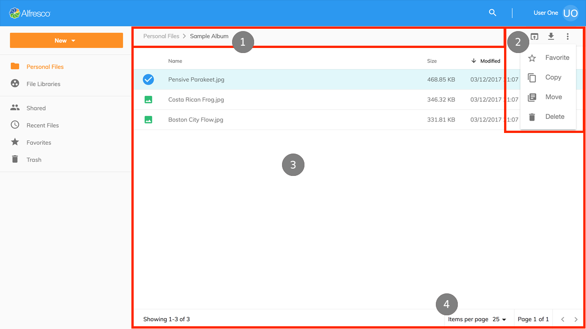

### Document List Layout

The main area of the application is composed of several individual ADF components:

- (1) [Breadcrumb](https://alfresco.github.io/adf-component-catalog/components/BreadcrumbComponent.html)
- (2) [Toolbar](https://alfresco.github.io/adf-component-catalog/components/ToolbarComponent.html)
- (3) [Document List](https://alfresco.github.io/adf-component-catalog/components/DocumentListComponent.html)
- (4) [Pagination](https://alfresco.github.io/adf-component-catalog/components/PaginationComponent.html)

The application has six different Document List views which share commonalities between each view and subtle differences depending on the content being loaded which are explained below.

#### Personal Files

Personal Files retrieves all content from the logged in user's home area (`/User Homes/<username>/`) in the repository;
if the user is ‘admin’ who does not have a home folder then the repository root folder is shown.

Personal Files is the [Files](https://github.com/Alfresco/alfresco-content-app/tree/master/src/app/components/files) component,
using the [Nodes API](https://api-explorer.alfresco.com/api-explorer/#/nodes).

#### File Libraries

File Libraries retrieves all the sites that the user is a member of including what type of site it is: public, moderated or private.
File Libraries is the [Libraries](https://github.com/Alfresco/alfresco-content-app/tree/master/src/app/components/libraries) component,
using the [Sites API](https://api-explorer.alfresco.com/api-explorer/#/sites).

When a user opens one of their sites then the content for the site's document library is shown.
To display the files and folders from a site (`/Sites/<siteid>/Document Library/`) the [Files](https://github.com/Alfresco/alfresco-content-app/tree/master/src/app/components/files) component,
using the [Nodes API](https://api-explorer.alfresco.com/api-explorer/#/nodes) is used.

#### Shared Files

The Shared Files view aggregates all files that have been shared using the QuickShare feature in the content repository.
The [Shared Files](https://github.com/Alfresco/alfresco-content-app/tree/master/src/app/components/shared-files) component uses the [shared-links API](https://api-explorer.alfresco.com/api-explorer/#/shared-links)
and includes extra columns to display where the file is
[located](https://github.com/Alfresco/alfresco-content-app/tree/master/src/app/components/location-link)
in the content repository and who created the shared link.

A feature for creating and removing Shared Links will be added in the future.

#### Recent Files

The Recent Files view shows all the files that have been created or modified within the last 30 days by the current user.
The [Recent Files](https://github.com/Alfresco/alfresco-content-app/tree/master/src/app/components/current-user)
component uses the Search API to query SOLR for changes made by the user and includes an extra column to display where the file is
[located](https://github.com/Alfresco/alfresco-content-app/tree/master/src/app/components/location-link)
in the content repository.

#### Favorites

The Favorites view shows all files and folders from the content repository that have been marked as a favorite by the current user.
The [Favorites](https://github.com/Alfresco/alfresco-content-app/tree/master/src/app/components/favorites) component uses the
[favorites](https://api-explorer.alfresco.com/api-explorer/#/favorites) API to retrieve all the favorite nodes for the user
and includes an extra column to display where the file is
[located](https://github.com/Alfresco/alfresco-content-app/tree/master/src/app/components/location-link)
in the content repository.

#### Trash

The Trash view shows all the items that a user has deleted, admin will see items deleted by all users.
The actions available in this view are Restore and Permanently Delete.
The [Trashcan](https://github.com/Alfresco/alfresco-content-app/tree/master/src/app/components/trashcan) component uses the
[trashcan](https://api-explorer.alfresco.com/api-explorer/#/trashcan) API to retrieve the deleted items
and perform the actions requested by the user and includes an extra column to display where the item was
[located](https://github.com/Alfresco/alfresco-content-app/tree/master/src/app/components/location-link)
in the content repository before it was deleted.

#### Actions and the Actions Toolbar

All the views incorporate the [toolbar](https://alfresco.github.io/adf-component-catalog/components/ToolbarComponent.html)
component from the Alfresco Application Development Framework;
apart from the Trash view they all display the following actions when the current user has the necessary permissions,
actions are automatically hidden when the user does not have permission.

<table>
<thead>
    <th>Action</th>
    <th>File</th>
    <th>Folder</th>
</thead>
<tbody>
    <tr>
        <td>View</td>
        <td>
            Opens the selected file using the <a href="https://github.com/Alfresco/alfresco-content-app/tree/development/src/app/components/preview" target="_blank">Preview</a> component,
            where the file cannot be displayed natively in a browser a PDF rendition is obtained from the repository.
        </td>
        <td>Not applicable</td>
    </tr>
    <tr>
        <td>Download</td>
        <td>Downloads single files to the user's computer, when multiple files are selected they are compressed into a ZIP and then downloaded.</td>
        <td>Folders are automatically compressed into a ZIP and then downloaded to the user's computer.</td>
    </tr>
    <tr>
        <td>Edit</td>
        <td>Not applicable</td>
        <td>The folder name and description can be edited in a dialog.</td>
    </tr>
    <tr>
        <td>Favorite</td>
        <td colspan="2">
            Toggle the favorite mark on or off for files and folders, when multiple items are selected
            and one or more are not favorites then the mark will be toggled on.
        </td>
    </tr>
    <tr>
        <td>Copy</td>
        <td colspan="2">
            Files and folders can be copied to another location in the content repository using the
            <a href="https://alfresco.github.io/adf-component-catalog/components/ContentNodeSelectorComponent.html" target="_blank">content-node-selector</a> component;
            once the copy action has completed the user is notified and can undo the action (which permanently deletes the created copies).
        </td>
    </tr>
    <tr>
        <td>Move</td>
        <td colspan="2">
            Files and folders can be moved to another location in the content repository using the
            <a href="https://alfresco.github.io/adf-component-catalog/components/ContentNodeSelectorComponent.html" target="_blank">content-node-selector</a> component;
            once the move action has completed the user is notified and can undo the action (which moves the items back to the original location).
        </td>
    </tr>
    <tr>
        <td>Delete</td>
        <td colspan="2">
            Files and folders can be deleted from their location in the content repository;
            once the delete action has completed the user is notified and can undo the action (which restores the items from the trash).
        </td>
    </tr>
</tbody>
</table>

Besides the actions available in the toolbar users can single click an item to select it,
or double click on a file to view it, and a folder to open it.
