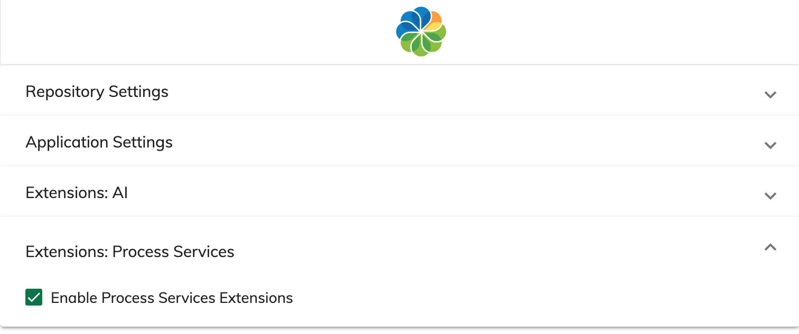

# Settings

The application settings can be accessed via the `/settings` route.

You can project custom configuration groups via the `settings` section:

```json
{
  "settings": [
    {
      "id": "extensions.ps.settings",
      "name": "Extensions: Process Services",
      "parameters": [
        {
          "name": "Enable Process Services Extensions",
          "key": "processServices",
          "type": "boolean",
          "value": false
        }
      ]
    }
  ]
}
```

At runtime, you are going to get an extra group called "Extensions: Process Services"
with a custom boolean setting "Enable Process Services Extensions".



## Parameters

Each setting parameter object supports the following properties:

| Property | Description                                     |
| -------- | ----------------------------------------------- |
| id       | (optional) Unique identifier                    |
| name     | Public name, can be translation key             |
| key      | The key to use when saving to the storage       |
| type     | The type of the value (boolean / string)        |
| value    | (optional) Default value to use for the setting |
