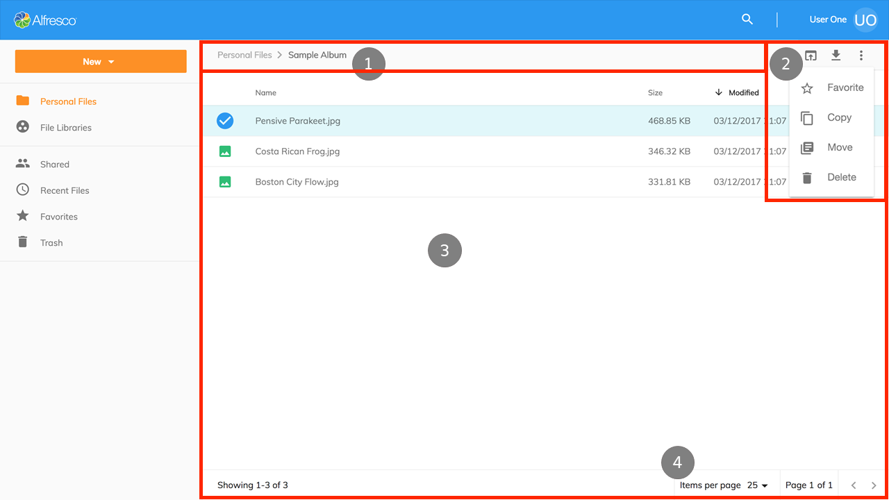

# Document List Layout

The main area of the application is composed of several individual ADF components:

1. [Breadcrumb](https://www.alfresco.com/abn/adf/docs/content-services/components/breadcrumb.component/)
2. [Toolbar](https://www.alfresco.com/abn/adf/docs/core/components/toolbar.component/)
3. [Document List](https://www.alfresco.com/abn/adf/docs/content-services/components/document-list.component/)
4. [Pagination](https://www.alfresco.com/abn/adf/docs/core/components/pagination.component/)

The application has seven different Document List views which share commonalities between each view and subtle differences depending on the content being loaded which are explained below.

## Personal Files

Personal Files retrieves all content from the logged in user's home area (`/User Homes/<username>/`) in the repository;
if the user is ‘admin’ who does not have a home folder then the repository root folder is shown.

Personal Files is the `Files` component,
using the [Nodes API](https://api-explorer.alfresco.com/api-explorer/#/nodes).

## File Libraries

File Libraries retrieves all the sites that the user is a member of including what type of site it is: public, moderated or private.
File Libraries is the `Libraries` component,
using the [Sites API](https://api-explorer.alfresco.com/api-explorer/#/sites).

When a user opens one of their sites then the content for the site's document library is shown.
To display the files and folders from a site (`/Sites/<siteid>/Document Library/`) the `Files` component,
using the [Nodes API](https://api-explorer.alfresco.com/api-explorer/#/nodes) is used.

## Shared Files

The Shared Files view aggregates all files that have been shared using the QuickShare feature in the content repository.
The `Shared Files` component uses the [shared-links API](https://api-explorer.alfresco.com/api-explorer/#/shared-links)
and includes extra columns to display where the file is located
in the content repository and who created the shared link.

## Recent Files

The Recent Files view shows all the files that have been created or modified within the last 30 days by the current user.
The `Recent Files`
component uses the Search API to query SOLR for changes made by the user and includes an extra column to display where the file is located
in the content repository.

## Favorites

The Favorites view shows all files and folders from the content repository that have been marked as a favorite by the current user.
The `Favorites` component uses the
[favorites](https://api-explorer.alfresco.com/api-explorer/#/favorites) API to retrieve all the favorite nodes for the user
and includes an extra column to display where the file is located in the content repository.

## Trash

The Trash view shows all the items that a user has deleted, admin will see items deleted by all users.
The actions available in this view are Restore and Permanently Delete.
The `Trashcan`` component uses the
[trashcan](https://api-explorer.alfresco.com/api-explorer/#/trashcan) API to retrieve the deleted items
and perform the actions requested by the user and includes an extra column to display where the item was located in the content repository before it was deleted.

## Search Results

The Search Results view shows the found items for a search query. It has a custom layout template and users can easily browse the results and perform actions on items.
For more information on the `Search Component`, please also check this [Search Results](/features/search-results) section.

Another custom template layout shows the results when searching for libraries so that users can find, join and favorite libraries that they aren't already members of.

## Actions and the Actions Toolbar

All the views incorporate the [toolbar](https://www.alfresco.com/abn/adf/docs/core/components/toolbar.component/)
component from the Alfresco Application Development Framework.

Actions are displayed in the toolbar when item(s) are selected, or a right click is performed; apart from the Trash view they all display the following actions when the current user has the necessary permissions,
actions are automatically hidden when the user does not have permission.

| Action | File | Folder |
| -- | -- | -- |
| Edit in Microsoft Office | Opens Word, PowerPoint and Excel files directly in your Microsoft Office applications, requires Alfresco Office Services | Not applicable |
| Edit offline | Downloads the file and locks it in the repository for offline editing | Not applicable |
| Upload a new version | Upload a new version for the selected file | Not applicable |
| Share | Create and copy a link to a file that can be shared, the links are accessible without granting permissions to the file, and do not require users to login to the application.  Share links can automatically expire based on a date, the minimum expiry date is controlled by the Content Services repository, which is 1 day from the date of creation. | Not applicable |
| Download | Downloads single files to the user's computer, when multiple files are selected they are compressed into a ZIP and then downloaded. | Folders are automatically compressed into a ZIP and then downloaded to the user's computer. |
| View | Opens the selected file using the `Preview component`. If the file cannot be displayed natively in a browser, a PDF rendition is obtained from the repository. | Not applicable |
| Edit | Not applicable | The folder name and description can be edited in a dialog. |
| Favorite | Toggle the favorite mark on or off for files and folders. If multiple items are selected and one or more are not favorites then the mark will be toggled on. |
| Copy | Files and folders can be copied to another location in the content repository using the [Content node selector component](https://www.alfresco.com/abn/adf/docs/content-services/components/content-node-selector.component/). When the copy action has completed the user is notified and can undo the action (which permanently deletes the created copies). |
| Move | Files and folders can be moved to another location in the content repository using the [Content node selector component](https://www.alfresco.com/abn/adf/docs/content-services/components/content-node-selector.component/). When the move action has completed the user is notified and can undo the action (which moves the items back to the original location). |
| Delete | Files and folders can be deleted from their location in the content repository. When the delete action has completed the user is notified and can undo the action (which restores the items from the trash). |
| Manage Versions | Versions of files can be viewed, uploaded, restored, downloaded and deleted by using the version manager dialog. When each action has completed the list of versions is updated according to the change. | Not applicable |
| Permissions | Permissions on a file can be adjusted as required in a number of ways; disable inheritance from the parent folder, change a user or groups role and grant users/groups access. | Not available |

Besides the actions available in the toolbar users can:

* single click on a file to view it, and a folder to open it
* single click an item to select it
* double click on a file to view it, and a folder to open it
