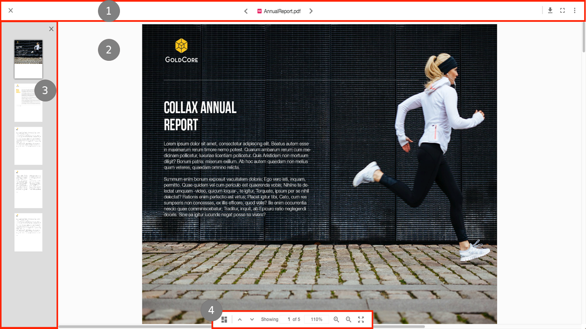

# File Viewer

The File Viewer has been created using the [ViewerComponent](https://www.alfresco.com/abn/adf/core/viewer.component/) from ADF.

The Viewer has four main areas:

1. [Header & Toolbar](#header-and-toolbar)
2. [Content](#content)
3. [Thumbnails side pane](#thumbnails-side-pane)
4. [Viewer Controls](#viewer-controls)

## Header and Toolbar

The Header & Toolbar section of the viewer contains a number of features that relate to the file currently being displayed:

- Close 'X' will return the user to the folder that contains the file.
- The name and file type icon is shown in the middle.
- Next and previous buttons will be displayed either side of the file name so that users can navigate to other files in the folder without navigating away from the viewer.
- Finally, on the right hand side an actions toolbar provides users with the ability to download, favorite, move, copy, delete, manage versions and view info panel.

## Content

The File Viewer consists of four separate views that handle displaying the content based on four types of content, covering various [file/mime](https://www.alfresco.com/abn/adf/core/viewer.component/#supported-file-formats) types:

- Document View: PDF files are displayed in the application File Viewer, for other document types (DOCX etc) then a PDF rendition is automatically retrieved.
- Image View: JPEG, PNG, GIF, BMP and SVG images are natively displayed in the application File Viewer.
- Media View: MP4, MP3, WAV, OGG and WEBM files are played natively application File Viewer. The File Viewer will download, by default, 50MB of the content at a time to ensure a smooth playback of the content.
- Text View: TXT, XML, JS, HTML, JSON and TS files are natively displayed as text in the application File Viewer.

## Thumbnails side pane

The Document View includes a thumbnails pane which can be activated by a button in the Viewer Actions toolbar. Clicking on a thumbnail will take a user directly to the selected page and as users scroll through a document the current page is highlighted in the pane.

## Viewer Controls

At the bottom of the content the Viewer Controls allow users to interact with the content in various ways; the actions available are dependant on the type of content being displayed.

- Document View:
  - Activate/Deactivate thumbnails pane
  - Previous/Next page
  - Jump to page number
  - Zoom in/out
  - Fit to page
  - Print
- Image View:
  - Zoom in/out
  - Rotate left/right (does not alter content in the repository)
  - Reset image
  - Print
- Media View:
  - Play/pause
  - Timeline position
  - Toggle audio
  - Audio volume
  - Full screen
