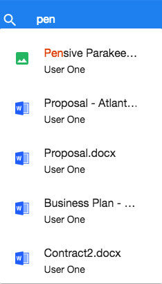
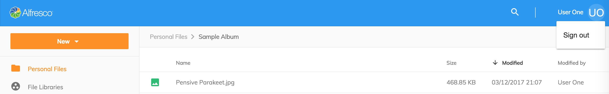

# Header

The application header has three main elements.

1. [Logo and Color](#logo-and-color)
2. [Search](#search)
3. [Current User](#current-user)

## Logo and Color

Logo & app primary color - logo and color are configurable by updating the
`app.config.json` file in the root folder of the project.
Please refer to the [Application Configuration](/getting-started/configuration) documentation for more information on how to change the logo and color.

## Search

The application Search -
uses the [ADF Search Component](https://www.alfresco.com/abn/adf/docs/content-services/components/search.component/).
The app provides a 'live' search feature, where users can open files and folders directly from the Search API results.

If you type `Enter` in the text input area, you are going to see
[Search Results](/features/search-results) page
with advanced filtering and faceted search.

## Current User

Current User -
displays the user's name, and a menu where users can logout.
Optionally through updating the `app.config.json`
a language switching menu can be displayed.

