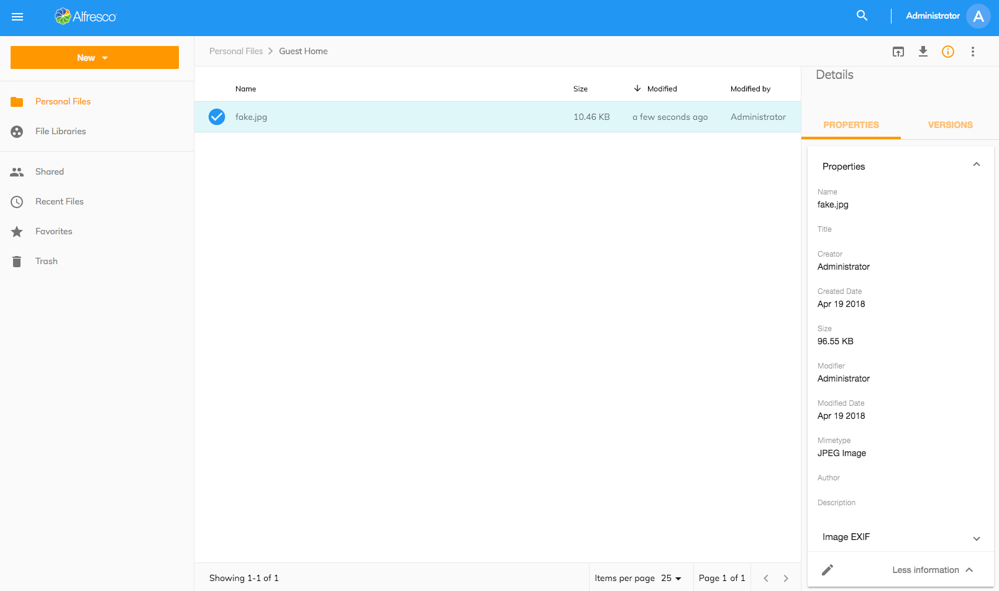

# Info Drawer

The Info Drawer displays node information in the right sidebar panel.

It is created by using the [Info Drawer Component](https://www.alfresco.com/abn/adf/core/info-drawer.component/). This info is available for both folder and file nodes.

Currently, there are 2 tabs available: Properties and Versions.

## Properties tab

The Properties tab displays the node's metadata info by using the [Content Metadata Card Component](https://www.alfresco.com/abn/adf/core/content-metadata-card.component/).

For more information, please check also the [Content Metadata Component](https://www.alfresco.com/abn/adf/core/content-metadata.component/).

## Comments tab

The Comments tab displays all comments made on the selected node in the respoistory by using the [Comments Component](https://www.alfresco.com/abn/adf/core/comments.component/).  Users can post new comments that will be displayed immediately.
