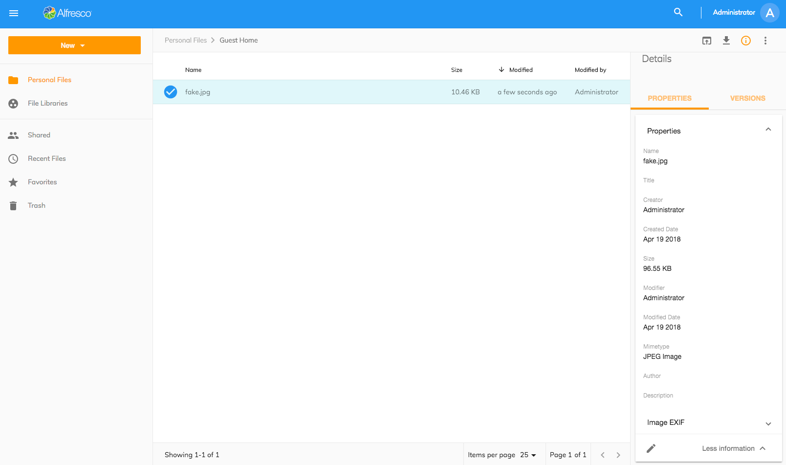

# Info Drawer

The Info Drawer displays node information in the right sidebar panel.

It is created by using the [Info Drawer Component](https://www.alfresco.com/abn/adf/core/info-drawer.component/). This info is available for both folder and file nodes.

Currently, the following tabs are available: Properties, Comments and Associations.

## Properties tab

The Properties tab displays the node's metadata info by using the [Content Metadata Card Component](https://www.alfresco.com/abn/adf/core/content-metadata-card.component/).

For more information, please check also the [Content Metadata Component](https://www.alfresco.com/abn/adf/core/content-metadata.component/).

## Comments tab

The Comments tab displays all comments made on the selected node in the respoistory by using the [Comments Component](https://www.alfresco.com/abn/adf/core/comments.component/).  Users can post new comments that will be displayed immediately.

## Versions tab
Versions tab displays all versions of the selected node.

## Associations tab

The Associations tab lists the target associations of the selected node (the nodes it points to) and lets users manage them.

- Each association is shown with a `link` icon, the target node name, and the association type.
- **Create Association** opens a dialog where the user enters an association type and picks a target node using the [Content Node Selector Panel Component](https://www.alfresco.com/abn/adf/content-services/content-node-selector-panel.component/). Only JSON files can be selected as targets.
- Each item has a trailing delete action that asks for confirmation before removing the association.

The tab is contributed as an extension (`app.components.tabs.associations`) and is visible for all nodes except libraries.
