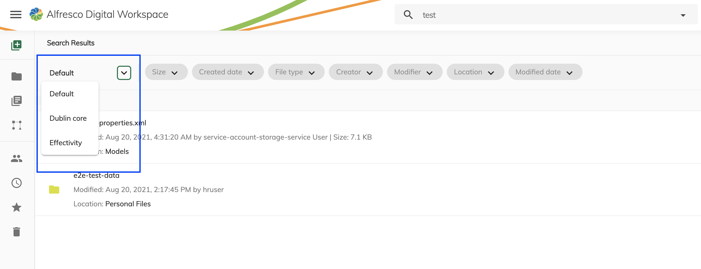

# Search Forms

## Multiple search configuration

Since version 2.5.0 is now possible have multiple facet search configurations:

In order to configure multiple search form you have to add your search configuration in `src/assets/plugins/app.search.json` in the property array `features.search`.

### Extension Properties

| Name | Type | Default value | Description |
| ---- | ---- | ------------- | ----------- |
| id | `string` |  | Unique identifier of the search |
| name | `string` | "" | Display title of the form |
| order | `string` |  | Visualization order in the dropdown  |
| default | `boolean` |  | if the search has to be used as default search  |
| aca:fields| `string[]`| | list of aspects property to add in the query and search in the value for the given text. The property will be concatenated in AND|

### Search configuration properties

In order to learn more about :
-The search UI configuration possibilities refer to the [ADF Search configuration documentation](https://github.com/Alfresco/alfresco-ng2-components/blob/develop/docs/user-guide/search-configuration-guide.md)
-The search Query configuration possibilities refer to the [Full text search reference documentation](https://docs.alfresco.com/search-services/latest/using/)

