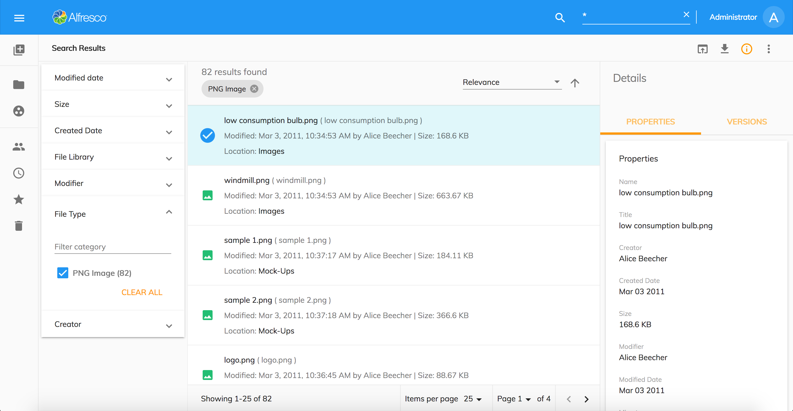

# Search Results

When you type queries into the Search Input component, the application will return the Search Results in a page. From the search results page you can open files and perform various actions depending on the permissions available for the selected item.



This page consists of the following ADF components:

- [Search Filter](https://www.alfresco.com/abn/adf/docs/content-services/components/search-filter.component/)
- [Search Chip List](https://www.alfresco.com/abn/adf/docs/content-services/components/search-chip-list.component/)
- [Search Sorting Picker](https://www.alfresco.com/abn/adf/docs/content-services/components/search-sorting-picker.component/)
- [Document List](https://www.alfresco.com/abn/adf/docs/content-services/components/document-list.component/) with custom layout template
- [Info Drawer](/features/info-drawer) with Metadata and [Version Management](#version-manager)
- [Toolbar with basic actions](/features/document-list-layout#actions-and-the-actions-toolbar) like `Preview`, `Download`, `Favorite`, `Copy`, etc.

And also the Info Drawer, Toolbar and Node Selector dialogs for copy and move operations.

## Alfresco Full Text Search

The following table describes current support of the
[Alfresco Full Text Search](http://docs.alfresco.com/6.1/concepts/rm-searchsyntax-intro.html) (FTS) syntax
in the Content Application when using **Search Input** component.

| Feature                                                          | Full | Partial | N/A | Details                                                                            |
| ---------------------------------------------------------------- | ---- | ------- | --- | ---------------------------------------------------------------------------------- |
| Search for a single term                                         | 1.6  |         |     | [Docs](https://docs.alfresco.com/6.0/concepts/rm-searchsyntax-single.html)         |
| Search for a phrase                                              |      | 1.7     |     | [Docs](https://docs.alfresco.com/6.0/concepts/rm-searchsyntax-phrase.html)         |
| Search for an exact term                                         | 1.7  |         |     | [Docs](https://docs.alfresco.com/6.0/concepts/rm-searchsyntax-exact.html)          |
| Search for term expansion                                        |      |         | X   | [Docs](https://docs.alfresco.com/6.0/concepts/rm-searchsyntax-term.html)           |
| Search for conjunctions                                          | 1.7  |         |     | [Docs](https://docs.alfresco.com/6.0/concepts/rm-searchsyntax-conjunct.html)       |
| Search for disjunctions                                          | 1.7  |         |     | [Docs](https://docs.alfresco.com/6.0/concepts/rm-searchsyntax-disjunct.html)       |
| Search for negation                                              |      |         | X   | [Docs](https://docs.alfresco.com/6.0/concepts/rm-searchsyntax-negate.html)         |
| Search for optional, mandatory, and excluded elements of a query |      |         | X   | [Docs](https://docs.alfresco.com/6.0/concepts/rm-searchsyntax-optional.html)       |
| Search in fields                                                 |      | 1.7     |     | [Docs](https://docs.alfresco.com/6.0/concepts/rm-searchsyntax-fields.html)         |
| Search for wildcards                                             |      | 1.7     |     | [Docs](https://docs.alfresco.com/6.0/concepts/rm-searchsyntax-wildcards.html)      |
| Search for ranges                                                |      |         | X   | [Docs](https://docs.alfresco.com/6.0/concepts/rm-searchsyntax-ranges.html)         |
| Search for fuzzy matching                                        |      |         | X   | [Docs](https://docs.alfresco.com/6.0/concepts/rm-searchsyntax-fuzzy.html)          |
| Search for proximity                                             |      |         | X   | [Docs](https://docs.alfresco.com/6.0/concepts/rm-searchsyntax-proximity.html)      |
| Search for boosts                                                |      |         | X   | [Docs](https://docs.alfresco.com/6.0/concepts/rm-searchsyntax-boosts.html)         |
| Search for grouping                                              |      |         | X   | [Docs](https://docs.alfresco.com/6.0/concepts/rm-searchsyntax-grouping.html)       |
| Search for spans and positions                                   |      |         | X   | [Docs](https://docs.alfresco.com/6.0/concepts/rm-searchsyntax-spans.html)          |
| Escaping characters                                              |      |         | X   | [Docs](https://docs.alfresco.com/6.0/concepts/rm-searchsyntax-escaping.html)       |
| Mixed FTS ID behavior                                            |      |         | X   | [Docs](https://docs.alfresco.com/6.0/concepts/rm-searchsyntax-ftsid.html)          |
| Search for operator precedence                                   |      |         | X   | [Docs](https://docs.alfresco.com/6.0/concepts/rm-searchsyntax-precedence.html)     |
| Search query templates                                           |      |         | X   | [Docs](https://docs.alfresco.com/6.0/concepts/rm-searchsyntax-querytemplates.html) |
| Search query literals                                            |      |         | X   | [Docs](https://docs.alfresco.com/6.0/concepts/rm-searchsyntax-literals.html)       |
| Search using date math                                           |      |         | X   | [Docs](https://docs.alfresco.com/6.0/concepts/rm-searchsyntax-datemaths.html)      |

> **Partial** support means the feature supports basic scenarios
> and there are edge cases that are not yet fully tested and might not work.

## Search Queries and Precise Searching

You can customize the queries to get better results.

Given that, no colon ":" suffixes the term, then the default query is constructed for text searches. The default query is:

```text
(cm:name:"[term]*" OR cm:title:"[term]*" OR cm:description:"[term]*" OR TEXT:"[term]*" OR TAG:"[term]*")
```

Note that compared to Share the following defaults are removed from ACA:

```text
OR ia:whatEvent:"[term]*" OR ia:descriptionEvent:"[term]*" OR lnk:title:"[term]*" OR lnk:description:"[term]*"
```

### Key facts

If you have entered more than one word into the search input box, then the search query is constructed automatically using an `AND` operation.

I you have entered more than one word encapsulated in quotation marks, then the search query is constructed treated everything as a single string.

If you have entered more than one word separated by `AND`, then the search query is constructed using an `AND` conjunction.

If you have entered more than one word separated by `OR`, then the search query is constructed using an `OR` disjunction.

If you have entered an `=` symbol before the search term, then the search query is constructed using exact term matching.

### Examples

| Search Type | Search input | Expected result |
| --- | --- | --- |
| Single Term | banana | Nodes that contain the term **banana** in any content | 
| Conjunction | big yellow banana | Nodes that contain all of the terms **big**, **yellow**, and **banana** |
| Phrase | "big yellow banana" | Nodes that contain all of the terms **big**, **yellow**, and **banana** |
| Conjunction | big AND yellow AND banana | Nodes that contain all of the terms **big**, **yellow**, and **banana** |
| Disjunction | orange OR banana OR apple | Nodes that contain at least one of the terms **orange**, **banana** or **apple** |
| Exact term | =orange | Nodes that contain the exact term **orange** in any content |

