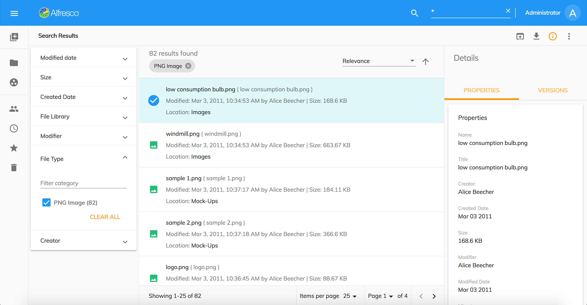

# Search Results

When you type queries into the Search Input component, the application will return the Search Results in a page. From the search results page you can open files and perform various actions depending on the permissions available for the selected item.



This page consists of the following ADF components:

- [Search Filter](https://www.alfresco.com/abn/adf/docs/content-services/components/search-filter.component/)
- [Search Chip List](https://www.alfresco.com/abn/adf/docs/content-services/components/search-chip-list.component/)
- [Search Sorting Picker](https://www.alfresco.com/abn/adf/docs/content-services/components/search-sorting-picker.component/)
- [Document List](https://www.alfresco.com/abn/adf/docs/content-services/components/document-list.component/) with custom layout template
- [Info Drawer](/features/info-drawer) with Metadata and [Version Management](#version-manager)
- [Toolbar with basic actions](/features/document-list-layout#actions-and-the-actions-toolbar) like `Preview`, `Download`, `Favorite`, `Copy`, etc.

And also the Info Drawer, Toolbar and Node Selector dialogs for copy and move operations.

## Alfresco Full Text Search

The following table describes current support of the
[Alfresco Full Text Search](https://support.hyland.com/r/Alfresco/Alfresco-Search-Services/2.0/Alfresco-Search-Services/Using/Full-text-search-reference) (FTS) syntax
in the Content Application when using **Search Input** component.

| Feature                                                          | Full | Partial | N/A | Details                                                                            |
| ---------------------------------------------------------------- | ---- | ------- | --- | ---------------------------------------------------------------------------------- |
| Search for a single term                                         | 1.6  |         |     | [Docs](https://support.hyland.com/r/Alfresco/Alfresco-Search-Services/2.0/Alfresco-Search-Services/Using/Full-text-search-reference/Search-for-a-single-term)         |
| Search for a phrase                                              |      | 1.7     |     | [Docs](https://support.hyland.com/r/Alfresco/Alfresco-Search-Services/2.0/Alfresco-Search-Services/Using/Full-text-search-reference/Search-for-a-phrase)         |
| Search for an exact term                                         | 1.7  |         |     | [Docs](https://support.hyland.com/r/Alfresco/Alfresco-Search-Services/2.0/Alfresco-Search-Services/Using/Full-text-search-reference/Search-for-an-exact-term)          |
| Search for term expansion                                        |      |         | X   | [Docs](https://support.hyland.com/r/Alfresco/Alfresco-Search-Services/2.0/Alfresco-Search-Services/Using/Full-text-search-reference/Search-for-term-expansion)           |
| Search for conjunctions                                          | 1.7  |         |     | [Docs](https://support.hyland.com/r/Alfresco/Alfresco-Search-Enterprise/4.1/Alfresco-Search-Enterprise/Using/Search-query-syntax/Search-for-conjunctions)       |
| Search for disjunctions                                          | 1.7  |         |     | [Docs](https://support.hyland.com/r/Alfresco/Alfresco-Search-Services/2.0/Alfresco-Search-Services/Using/Full-text-search-reference/Search-for-disjunctions)       |
| Search for negation                                              |      |         | X   | [Docs](https://support.hyland.com/r/Alfresco/Alfresco-Search-Services/2.0/Alfresco-Search-Services/Using/Full-text-search-reference/Search-for-negation)         |
| Search for optional, mandatory, and excluded elements of a query |      |         | X   | [Docs](https://support.hyland.com/r/Alfresco/Alfresco-Search-Services/2.0/Alfresco-Search-Services/Using/Full-text-search-reference/Search-for-optional-mandatory-and-excluded-elements-of-a-query)       |
| Search in fields                                                 |      | 1.7     |     | [Docs](https://support.hyland.com/r/Alfresco/Alfresco-Search-Services/2.0/Alfresco-Search-Services/Using/Full-text-search-reference/Search-in-fields)         |
| Search for wildcards                                             |      | 1.7     |     | [Docs](https://support.hyland.com/r/Alfresco/Alfresco-Search-Services/2.0/Alfresco-Search-Services/Using/Full-text-search-reference/Search-for-wildcards)      |
| Search for ranges                                                |      |         | X   | [Docs](https://support.hyland.com/r/Alfresco/Alfresco-Search-Services/2.0/Alfresco-Search-Services/Using/Full-text-search-reference/Search-for-ranges)         |
| Search for fuzzy matching                                        |      |         | X   | [Docs](https://support.hyland.com/r/Alfresco/Alfresco-Search-Services/2.0/Alfresco-Search-Services/Using/Full-text-search-reference/Search-for-fuzzy-matching)          |
| Search for proximity                                             |      |         | X   | [Docs](https://support.hyland.com/r/Alfresco/Alfresco-Search-Services/2.0/Alfresco-Search-Services/Using/Full-text-search-reference/Search-for-proximity)      |
| Search for boosts                                                |      |         | X   | [Docs](https://support.hyland.com/r/Alfresco/Alfresco-Search-Services/2.0/Alfresco-Search-Services/Using/Full-text-search-reference/Query-time-boosts)         |
| Search for grouping                                              |      |         | X   | [Docs](https://support.hyland.com/r/Alfresco/Alfresco-Search-Services/2.0/Alfresco-Search-Services/Using/Full-text-search-reference/Search-for-grouping)       |
| Search for spans and positions                                   |      |         | X   | [Docs](https://support.hyland.com/r/Alfresco/Alfresco-Search-Services/2.0/Alfresco-Search-Services/Using/Full-text-search-reference/Search-for-spans-and-positions)          |
| Escaping characters                                              |      |         | X   | [Docs](https://support.hyland.com/r/Alfresco/Alfresco-Search-Services/2.0/Alfresco-Search-Services/Using/Full-text-search-reference/Escaping-characters)       |
| Mixed FTS ID behavior                                            |      |         | X   | [Docs](https://support.hyland.com/r/Alfresco/Alfresco-Search-Services/2.0/Alfresco-Search-Services/Using/Full-text-search-reference/Mixed-FTS-ID-behavior)          |
| Search for operator precedence                                   |      |         | X   | [Docs](https://support.hyland.com/r/Alfresco/Alfresco-Search-Services/2.0/Alfresco-Search-Services/Using/Full-text-search-reference/Search-for-operator-precedence)     |
| Search query templates                                           |      |         | X   | [Docs](https://support.hyland.com/r/Alfresco/Alfresco-Search-Services/2.0/Alfresco-Search-Services/Using/Full-text-search-reference/Search-query-templates) |
| Search query literals                                            |      |         | X   | [Docs](https://support.hyland.com/r/Alfresco/Alfresco-Search-Services/2.0/Alfresco-Search-Services/Using/Full-text-search-reference/Search-query-literals)       |
| Search using date math                                           |      |         | X   | [Docs](https://support.hyland.com/r/Alfresco/Alfresco-Search-Services/2.0/Alfresco-Search-Services/Using/Full-text-search-reference/Search-using-date-math)      |

> **Partial** support means the feature supports basic scenarios
> and there are edge cases that are not yet fully tested and might not work.

## Search Modes

The **Search Input** component supports two search modes. You can switch between them using the mode toggle displayed next to the search box:

- **Standard search** (default) — finds text exactly as you enter it. The application builds the query for you, matching your input against the fields configured for the active search form (see [Search Forms](/features/search-forms)). This is the recommended mode for everyday searching.
- **Formula search** — lets you build a query manually using
  [Alfresco Full Text Search](https://support.hyland.com/r/Alfresco/Alfresco-Search-Services/2.0/Alfresco-Search-Services/Using/Full-text-search-reference) (FTS) syntax.
  In this mode the application passes your input to the search service unchanged, so special characters such as `:`, `"`, `*` and the `AND`/`OR` operators are interpreted as search syntax.

The selected mode is preserved in the search URL, so it is restored when you reload the page or share a search link.

> In previous versions the application implicitly switched to raw query handling whenever it detected a `:` or `"` character in the input, and used a leading `=` symbol for exact-term matching. That implicit behavior has been removed in favor of the explicit **Formula search** mode. To run field-scoped queries, phrase queries, exact-term matching, or any other FTS syntax, switch to **Formula search**.

## Search Queries and Precise Searching

When using **Standard search**, the application constructs the query from your input. Given a single term, the default query matches that term against every field configured for the active search form:

```text
((cm:name:"[term]" OR cm:title:"[term]" OR cm:description:"[term]" OR TEXT:"[term]" OR TAG:"[term]"))
```

When [wildcard searching](#wildcard-searching) is enabled, a `*` suffix is appended to every term so that partial matches are also returned:

```text
((cm:name:"[term]*" OR cm:title:"[term]*" OR cm:description:"[term]*" OR TEXT:"[term]*" OR TAG:"[term]*"))
```

Note that compared to Share the following defaults are removed from ACA:

```text
OR ia:whatEvent:"[term]*" OR ia:descriptionEvent:"[term]*" OR lnk:title:"[term]*" OR lnk:description:"[term]*"
```

### Key facts

1. If you have entered more than one word into the search input box, then the search query is constructed automatically using an `AND` operation.

2. If you have entered more than one word separated by `AND`, then the search query is constructed using an `AND` conjunction. Since `AND` is the default operator (see fact 1), the explicit `AND` keywords are removed when the search input value is processed.

3. If you have entered more than one word separated by `OR`, then the search query is constructed using an `OR` disjunction. Unlike `AND`, the `OR` operators are preserved when processing the search input value because `OR` is not the default operator.

4. For phrase queries, exact-term matching, field-scoped queries, or any other advanced FTS syntax, switch to **Formula search** so that the input is sent to the search service unchanged.

### Examples

| Search Type            | Search mode | Entered search input value      | Expected result                                                                  |
| ---------------------- | ----------- | ------------------------------- | -------------------------------------------------------------------------------- |
| Single Term            | Standard    | banana                          | Nodes that contain the term **banana** in any configured field                   |
| Conjunction            | Standard    | big yellow banana               | Nodes that contain all of the terms **big**, **yellow**, and **banana**          |
| Conjunction            | Standard    | big AND yellow AND banana       | Nodes that contain all of the terms **big**, **yellow**, and **banana**          |
| Disjunction            | Standard    | orange OR banana OR apple       | Nodes that contain at least one of the terms **orange**, **banana** or **apple** |
| Phrase                 | Formula     | cm:name:"big yellow banana"     | Nodes whose `cm:name` contains the exact phrase **big yellow banana**            |
| Field-scoped / advanced| Formula     | TEXT:"orange" AND TAG:"fruit"   | The query is passed to the search service exactly as entered                     |

### Wildcard searching

Wildcard searching is controlled by the `search-wildcards-enabled` property in `app.config.json`:

```json
{
  "search-wildcards-enabled": true
}
```

| Value           | Behavior                                                                                                                      |
| --------------- | ----------------------------------------------------------------------------------------------------------------------------- |
| `true`          | A `*` suffix is appended to every term in **Standard search**, so partial matches are returned (e.g. `ban` matches `banana`). |
| `false`         | Terms are matched as entered, without an implicit trailing wildcard.                                                          |

This setting only affects how **Standard search** builds the query; in **Formula search** you control wildcards yourself by typing them into the query.

**Important note:** Consider using Search Logical Filter when you need to combine multiple search types. Mixing search types directly in the input may result in wrong query format and incorrect results.
