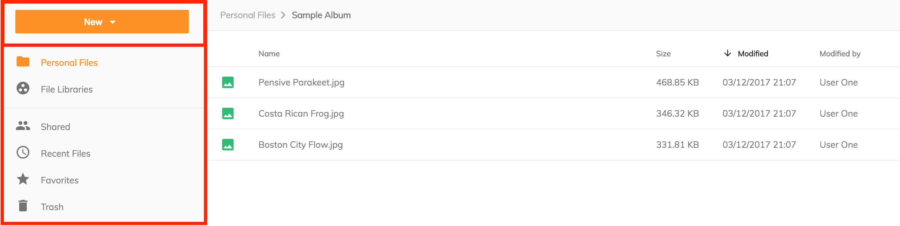
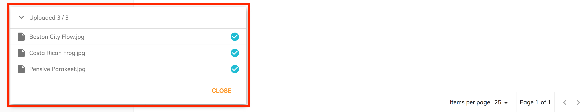

# Side Navigation

The application `Side Navigation` has two features: a button menu and navigation links.

## New button

The `New button` displays a menu which provides three actions:

- Create a new folder - provides a dialog which allows the creation of a new folder, the folder name is mandatory and the description is optional.
- Upload a file - invokes the operating system file browser and allows a user to select file(s) to upload into their current location in the content repository.
- Upload a folder - invokes the operating system folder browser and allows a user to select a folder to upload to their current location in the content repository.

When an upload starts the [upload component](https://www.alfresco.com/abn/adf/docs/content-services/components/file-uploading-dialog.component/)
is displayed which shows the user the progress of the uploads they have started.
The upload dialog persists on the screen and can be minimized; users are able to continue using the application whilst uploads are in progress
and uploads can be canceled which will stop uploads in progress or permanently delete already completed uploads.

## Navigation

The navigation links are configurable via the `app.config.json`.
Default configuration creates two sections.
See [Navigation](/getting-started/navigation) for more information about configuring the side navigation.
