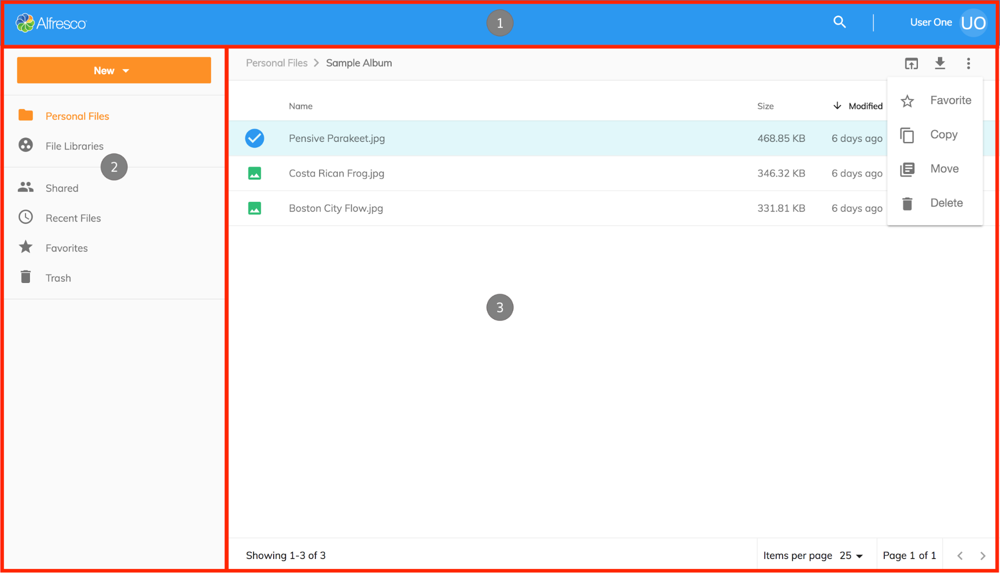

# User Interface - layout

There are three main areas of the application controlled by the `Layout component`:

1. [Application Header](/features/header)
2. [Side Navigation](/features/side-navigation)
3. [Document List](/features/document-list-layout)

