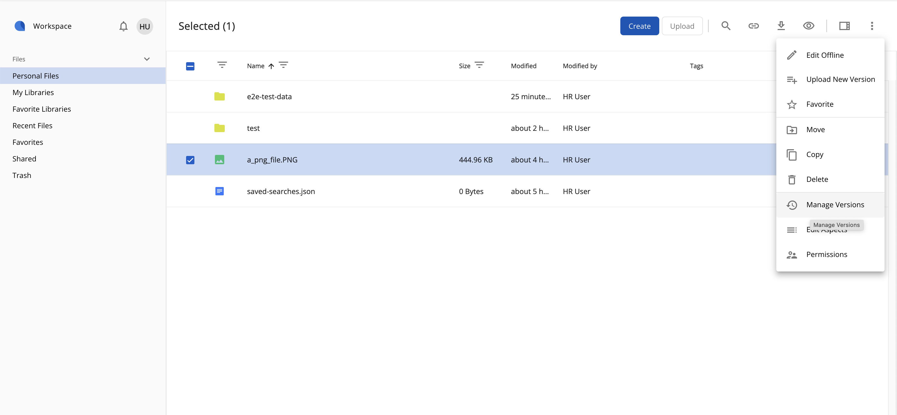
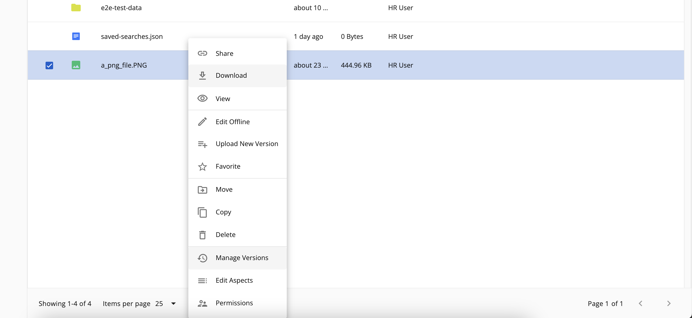

# Version Manager

The versions of a file can be viewed and managed by using the [Version Manager Component](https://github.com/Alfresco/alfresco-ng2-components/blob/develop/docs/content-services/components/version-manager.component.md) or using dialog version of version manager [New version uploader dialog](https://github.com/Alfresco/alfresco-ng2-components/blob/develop/docs/content-services/components/new-version-uploader.dialog.md).

There are 3 ways users can access the Version Manager:

1) From the 'Manage Versions' option of the 'More actions' menu (check [Actions and the Actions Toolbar](../features/document-list-layout#actions-and-the-actions-toolbar)):




2) From the [Info Drawer](../features/info-drawer) (the Details right panel):


3) From the context menu:



## Upload new version

A new version for the selected file can be added by using this button. Users can upload a new file version using a file that is does not have the same name, or mime type as the current version, whilst allowing the user to choose the type of version (minor or major) and inputting supporting comments.

Please also check the [UploadVersionButtonComponent](https://github.com/Alfresco/alfresco-ng2-components/blob/develop/docs/content-services/components/upload-version-button.component.md).

## Actions Menu

Each item in the version list has a couple of actions available: View, Restore, Download and Delete. These are displayed if user has permission to do that specific action.

Some of these options can be also enabled/disabled in app.config.json file. All configurable options are listed below:

| Option             | Default value | Description                                                         |
|--------------------|---------------|---------------------------------------------------------------------|
| allowComments      | true          | Show version's comment in list of versions if true, hide otherwise. |
| allowDownload      | true          | Allow to download versions if true, disallow otherwise.             |
| allowViewVersions  | true          | Allow to view versions if true, disallow otherwise.                 |
| allowVersionDelete | true          | Allow to delete versions if true, disallow otherwise.               |
| showActions        | true          | Allow to open actions menu when true, otherwise hides it.           |


Example of settings in the app.config.json file:

```json
{
   "adf-version-manager": {
       "allowComments": true,
       "allowDownload": true,
       "allowViewVersions": true,
       "allowVersionDelete": true,
       "showActions": true
   }
}
```

Clicking to delete a version of a file triggers a confirmation dialog. Please see the [Confirm Dialog Component](https://github.com/Alfresco/alfresco-ng2-components/blob/develop/docs/core/dialogs/confirm.dialog.md) for more info.
