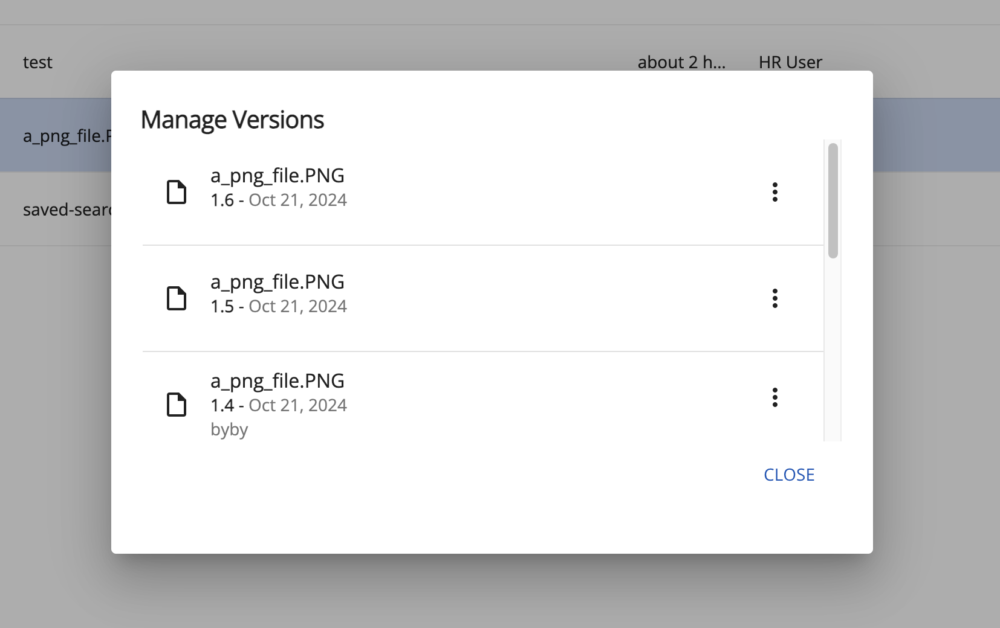

# Version Manager

The versions of a file can be viewed and managed by using the [Version Manager Component](https://www.alfresco.com/abn/adf/content-services/version-manager.component/).

There are 2 ways users can access the Version Manager:

1) From the 'Manage Versions' option of the 'More actions' menu (check [Actions and the Actions Toolbar](/features/document-list-layout#actions-and-the-actions-toolbar)):




2) From the [Info Drawer](/features/info-drawer) (the Details right panel):


## Upload new version

A new version for the selected file can be added by using this button. Users can upload a new file version using a file that is does not have the same name, or mime type as the current version, whilst allowing the user to choose the type of version (minor or major) and inputting supporting comments.

Please also check the [UploadVersionButtonComponent](https://www.alfresco.com/abn/adf/content-services/upload-version-button.component/).

## Actions Menu

Each item in the version list has a couple of actions available: Restore, Download and Delete. These are displayed if user has permission to do that specific action. The 'Download' and 'Delete' can be also disabled from the app.config.

In the app.config.json file, these are the current settings for the ACA version manager:

```json
{
   "adf-version-manager": {
       "allowComments": true,
       "allowDownload": true
   }
}
```

Set the allowComments to false if the version comments should not be displayed on the version list.

Clicking to delete a version of a file triggers a confirmation dialog. Please see the [Confirm Dialog Component](https://github.com/Alfresco/alfresco-ng2-components/blob/develop/lib/content-services/dialogs/confirm.dialog.ts) for more info.
