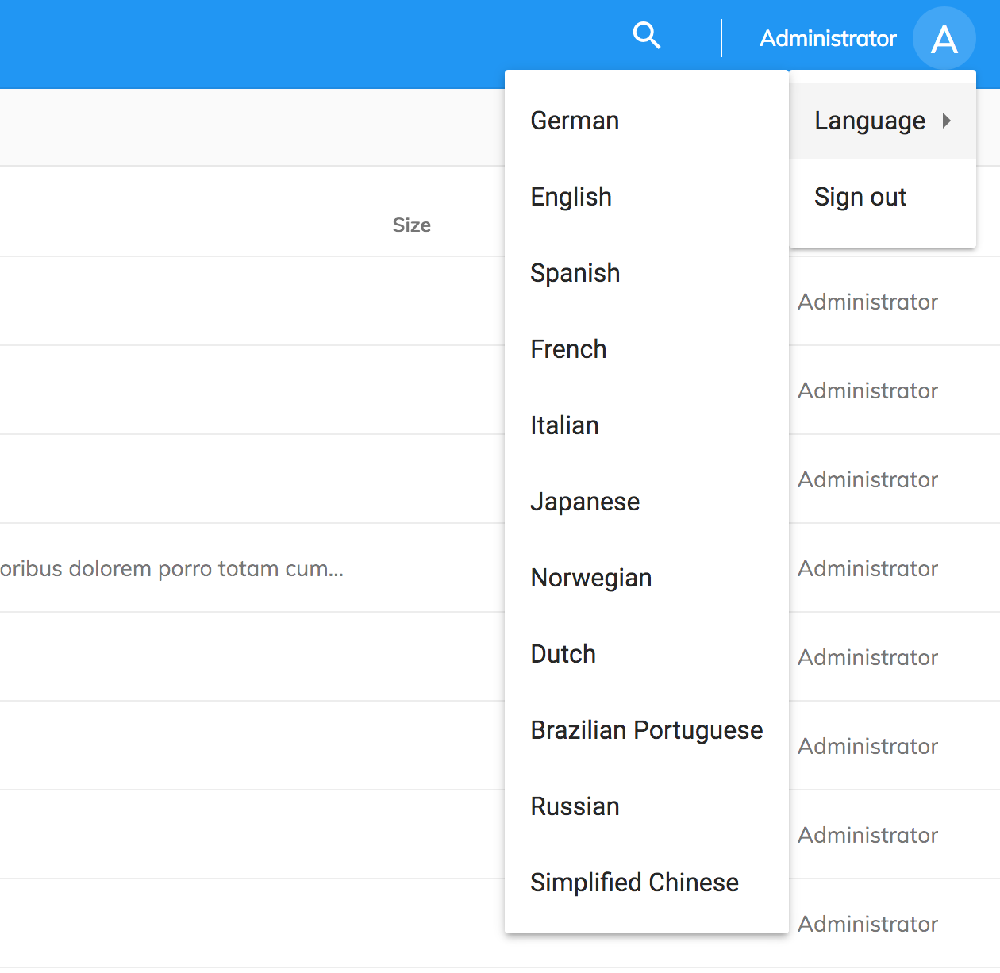

# Getting Started

## Prerequisites

This application uses the latest releases from Alfresco:

- [Alfresco ADF (2.4.0)](https://community.alfresco.com/community/application-development-framework/pages/get-started)
- [Alfresco Content Services (5.2.3)](https://www.alfresco.com/platform/content-services-ecm)
  or [Alfresco Community Edition (201802 EA)](https://www.alfresco.com/products/community/download)

<p class="warning">
You also need <a href="https://nodejs.org/en/" target="_blank">node.js</a> (LTS) installed to build it locally from source code.
</p>

The latest version of the Alfresco Content platform is required
due to the application using the latest [REST APIs](https://docs.alfresco.com/5.2/pra/1/topics/pra-welcome.html) developments.

## Building from source

The Content App is based on [Angular CLI](https://cli.angular.io), and you can use all the commands, generators and blueprints supported by the CLI.

### Prerequisites for building

- [Node.js](https://nodejs.org/en/) LTS
- [Angular CLI](https://cli.angular.io/) 1.7.3

### Cloning and running

Use the following commands to clone the project, install dependencies and run it.

```sh
git clone https://github.com/Alfresco/alfresco-content-app.git
cd alfresco-content-app
npm install
npm start
```

The application runs at port `4200` by default, and should automatically open in the default browser once project compilation finishes.

### Proxy settings

The Content App provides a proxy configuration for local development server
that allows you to address specific scenarios with CORS and native authentication dialog.

You can find settings in the "proxy.conf.js" file in the project root directory.

<p class="warning">
The proxy settings get automatically applied every time you run the application with "npm start" script.
You must restart the application every time you change the settings values.
</p>

### Running unit tests

Run `npm test` to execute the unit tests via [Karma](https://karma-runner.github.io).

## Internationalization (i18n)

The Content Application provides support for the following languages:

- German (`de`)
- English (`en`)
- Spanish (`es`)
- French (`fr`)
- Italian (`it`)
- Japanese (`ja`)
- Norwegian (`nb`)
- Dutch (`nl`)
- Brazilian Portuguese (`pt-BR`)
- Russian (`ru`)
- Simplified Chinese (`zh-CN`)

The fallback locale is the English one, however current browser language is taken as the default one automatically when the application starts.

### User-defined language

You can allow users to set custom language that gets saved to user preferences.
The main application menu already has the [ADF Language Menu](https://github.com/Alfresco/alfresco-ng2-components/blob/master/docs/core/language-menu.component.md) component integrated and pre-filled with the supported items.

To change the default language set edit the `app.config.json` file and add or remove items:

```json
{
    ...,
    "languages": [
        {
            "key": "de",
            "label": "German"
        },
        {
            "key": "en",
            "label": "English"
        },
        {
            "key": "es",
            "label": "Spanish"
        },
        ...
    ]
}
```

The file is located at the following path: `/src/app.config.json`.

### Custom languages

To add a custom language, add a new "JSON" file to the "/src/assets/i18n" folder
with the name of the target locale, for instance, a "de.json" for the "German".

Translate the resource strings based on the default "en.json" file.
You can copy the content over to your newly created file and replace English values with translated text.

```json
{
  "APP": {
    "SIGN_IN": "Anmelden",
    "SIGN_OUT": "Abmelden",
    "NEW_MENU": {
      "LABEL": "Neu",
      "MENU_ITEMS": {
        "CREATE_FOLDER": "Ordner erstellen",
        "UPLOAD_FILE": "Datei hochladen",
        "UPLOAD_FOLDER": "Ordner hochladen"
      },
      ...
    }
  },
  ...
}
```

The Content Application automatically bundles your file upon project build.
You can test your locale by changing the browser language settings and reloading the page.

Optionally, you can extend the [ADF Language Menu](https://github.com/Alfresco/alfresco-ng2-components/blob/master/docs/core/language-menu.component.md) component with the newly added language by updating the `app.config.json` file.

### Customizing ADF translations

In addition to creating a custom language file for the Content Application,
you can also provide translations for the ADF resources.

Your `/src/assets/i18n/<lang>.json` file can reflect the structure of one of the ADF language files:

- ADF Core ([en.json](https://github.com/Alfresco/alfresco-ng2-components/blob/master/lib/core/i18n/en.json))
- ADF Content Services ([en.json](https://github.com/Alfresco/alfresco-ng2-components/blob/master/lib/content-services/i18n/en.json))
- ADF Process Services ([en.json](https://github.com/Alfresco/alfresco-ng2-components/blob/master/lib/process-services/i18n/en.json))
- ADF Insights ([en.json](https://github.com/Alfresco/alfresco-ng2-components/blob/master/lib/insights/i18n/en.json))

At runtime, the application-level strings have the highest priority.
That means you can replace the value of any ADF resource string if needed.

For example, let's change the title of the "Create Folder" dialog shipped with the ADF.
Modify the `/src/assets/i18n/en.json` file and append the "CORE" section like in the example below:

```json
{
    "APP": {
        ...
    },
    "CORE": {
        "FOLDER_DIALOG": {
            "CREATE_FOLDER_TITLE": "Custom title"
        }
    }
}
```

Now, if you run the application and click the "New → Create Folder" menu,
the title of the dialog should look like the following:


### Language picker

You can enable internal language picker in the `app.config.json` file:

```json
{
    ...,

    "languagePicker": true,

    ...
}
```



## CORS

The ACA already comes with the proxy configuration for Angular CLI to address CORS-related issues for development.
Also, the docker images contain Nginx settings needed for CORS when developing and debugging application locally.

### Chrome Workaround

For the Chrome browser, you can use the following plugin that allows you to toggle CORS:
[Allow-Control-Allow-Origin](https://chrome.google.com/webstore/detail/allow-control-allow-origi/nlfbmbojpeacfghkpbjhddihlkkiljbi)

### Firefox Workaround

Firefox users can try the following plugin: [CORS Everywhere](https://addons.mozilla.org/en-Gb/firefox/addon/cors-everywhere/)

### Safari Workaround

If you are developing or testing with Safari then you can use the "Develop" menu to toggle the CORS mode.
Please note that the page must be reloaded every time you change CORS settings.


### See also

- [Using CORS](https://www.html5rocks.com/en/tutorials/cors/)

## Configuration

The Content Application provides support for a global settings file `app.config.json` that you can use to customize the behavior of ACA and ADF components.

### Server settings

Once the Content Application starts, it needs to know where the Alfresco Content Services (either Community or Enterprise) server is.
The "ecmHost" property allows you to set the address of the server using the dynamic or static format.

#### Dynamic address

The example below demonstrates the most common dynamic format for development environment:

```json
{
    "ecmHost": "http://{hostname}{:port}",
    ...
}
```

The configuration above assumes you are running ACS and Content App on the same server and port
and allows deploying to different servers having the same unified configuration file.

For example, a proxy server at `localhost:4200` hosting the Content App as the root application,
and `localhost:4200/alfresco` for the ACS repository.

At runtime, the application is going to automatically substitute the "{hostname}" value with the original hostname.
Optionally it can also use the value of the original port if present, for example, "4200" at local machines, or skip the value for port 80.

#### Static address

Alternatively, you can provide a static address for the ACS server if necessary:

```json
{
    "ecmHost": "http://localhost:4200",
    ...
}
```

### Application settings

There are many settings you can change to alter the default behavior of the application.

#### Application Name

The following block allows you to change the name of the application.

```json
{
    ...,
    "application": {
        "name": "Alfresco Example Content Application"
    }
}
```

The value of the `application.name` key gets appended to every browser tab title at runtime
with the format `[page title] - [application name]`,
for example: "Personal Files - Alfresco Example Content Application".

#### Application Logo

The default logo displayed in the top left corner of the Alfresco Content Application can be easily changed:

1. Place your custom logo image file in the [app-name]/src/assets/images folder. The displayed image will resize automatically, an image with extreme width/height might not retain its dimensions.

2. In the app.config.json file, set the value of the application.logo to contain the name of the custom logo image: "logo": "/assets/images/[image-name].[extension]"


```json
{
    ...,
    "application": {
        "logo": "/assets/images/alfresco-logo-white.svg"
    }
}
```

#### Header Background color

You can change the header background color by specifying color code for the "headerColor" key:

```json
{
    ...,
    "headerColor": "#2196F3"
}
```

#### Restricted content

You can restrict users from uploading certain types of files and folders by setting or extending the list of rules at the "files.excluded" path.

By default, the application ships with the following rules already predefined:

```json
{
    ...,
    "files": {
        "excluded": [
            ".DS_Store",
            "desktop.ini",
            "thumbs.db",
            ".git"
        ]
    },
    ...
}
```

<p class="tip">
You can get more details on the supported rules in the following article: <a href="https://github.com/Alfresco/alfresco-ng2-components/blob/master/docs/core/upload.service.md" target="_blank">Upload Service</a>.
</p>

#### Pagination settings

You can change the default settings of the pagination that gets applied to all the document lists in the application.

```json
{
    ...,
    "pagination": {
        "supportedPageSizes": [
            25,
            50,
            100
        ]
    },
    ...
}
```

### Your custom settings

You can store any information in the application configuration file, and access it at runtime by using the `AppConfigService` service provided by ADF.

<p class="tip">
Please refer to the <a href="https://github.com/Alfresco/alfresco-ng2-components/blob/master/docs/core/app-config.service.md" target="_blank">AppConfigService</a> documentation to get more details on Application Configuration features and API available.
</p>

## Navigation

The Alfresco Content Application provides the following navigation links:

- Personal Files
- File Libraries
- Shared
- Recent Files
- Favorites
- Trash

The side navigation provides support to customize the appearance of the links by editing the `app.config.json`.

### Customization

Navigation configuration supports array and object like schema. Defining an object helps navigation to render visual delimiters between different groups of links.

```json
{
  "navigation": {
     "main": [
      ...
     ],
   "secondary": [
     ...
    ]
  }
}
```


```json
{
  "navigation": [
    { ... },
    { ... },
    ...
  ]
}
```


#### Customize icons and text

`icon` -  supported value can be anything from [Material Design](https://material.io/icons) icons library. If not defined, the link will render just the label value.

`title` - instructs the link to render a native browser tooltip with the given value. It can be a string or a i18n defined reference. If not defined, the link will not show a tooltip.

`label` - represents the visual name of the link. It can be a string or a i18n defined reference.

<p class="danger">
  Changing ` "route": { "url": "/..." } ` value will affect the navigation since these are mapped to application routing system.
</p>

#### Custom text (i18n)

To change the `title` and `label` of navigation links edit the values under `BROWSE` entry found at `/src/assets/i18n/en.json`

```json
"APP" : {
  ...
  "BROWSE": {
    "PERSONAL": {
    "TITLE": "Personal Files",
    "SIDENAV_LINK": {
        "LABEL": "Personal Files",
        "TOOLTIP": "View your Personal Files"
      }
    },
    ...
  }
}
```

For more information about internationalization see [Internationalization (i18n)](#internationalization-i18n) section.

### User-defined navigation

To add custom navigation link for the application, first we need to create a component.

`src/app/components/custom-page/custom-page.component.ts`

```js
import { Component } from '@angular/core';

@Component({
template: `
    <h4>{{ title }}</h4>
    `
})
export class CustomPage {
    title = 'My Custom Page'
}
```

Register the component in ```app.module.ts```

```javascript

  ...
  import { CustomPage } from './components/custom-page/custom-page.component';

  @NgModule({
    ...
    declarations: [
        ...,
        CustomPage
    ],
    ...
})

```

In the `app.config.json` define a link entry which will point to the custom page

```json
{
  ...,
  "navigation": [
      "main": [ ... ],
      "secondary": [ ... ],
      "custom": [
        {
          "icon": "work",
          "label": "Link",
          "title": "My custom link",
          "route": {
              "url": "/custom-route"
          }
        }
      ]
  ]
}

```

Map the `/custom-route` in `app.routes.ts` as a child of `LayoutComponent` definition.

```js

  import { CustomPage } from './components/custom-page/custom-page.component.ts';

  ...
  {
    path: '',
    component: LayoutComponent,
    children: [
     ...,
     {
        path: 'custom-route',
        component: CustomPage
      }
    ]
  }
  ...,

```


For more information about the content of a custom page see [Document List Layout](/#document-list-layout) section.

## Docker

The ACA comes with the ACS 6.0 Community Edition preconfigured.
The application runs in to modes:

- Development (runs latest source code, requires building application)
- Preview (runs with latest published containers, master branch)

### Development Mode

Run the local instance of the application packaged into the docker image together with the ACS images:

```sh
npm run build
npm run start:docker
```

The ACA runs on port `4000` when served from within container.

Use the following command to stop all the containers:

```sh
npm run stop:docker
```

### Preview Mode

<p class="tip">
With this mode, you do not need building application from source code or installing dependencies.
</p>

To run the latest published container go to the `docker-compose` folder and start docker compose from there:

```sh
cd docker-compose
docker-compose up
```

The application is available at the `http://localhost:3000` address.
