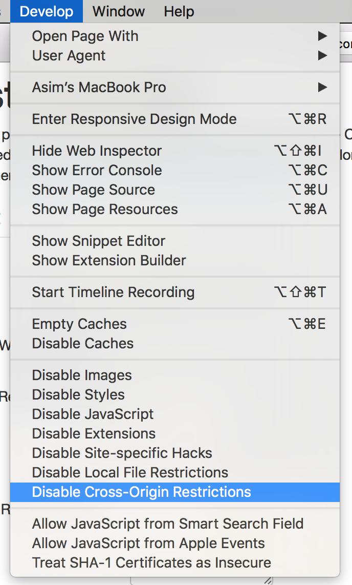

# CORS

The Alfresco Content Application comes with the proxy configuration for Angular CLI to address CORS-related issues for development.

Also, the docker images contain Nginx settings needed for CORS when developing and debugging an application locally.

## Chrome Workaround

For the Chrome browser, you can use the following plugin that allows you to toggle CORS:
[Allow-Control-Allow-Origin](https://chrome.google.com/webstore/detail/allow-control-allow-origi/nlfbmbojpeacfghkpbjhddihlkkiljbi)

## Firefox Workaround

For the Chrome browser, you can use the following plugin: [CORS Everywhere](https://addons.mozilla.org/en-Gb/firefox/addon/cors-everywhere/)

## Safari Workaround

If you are developing or testing with Safari then you can use the "Develop" menu to toggle the CORS mode.
Note, the page must be reloaded every time you change the CORS settings.

## See also

- [Using CORS](https://www.html5rocks.com/en/tutorials/cors/)
