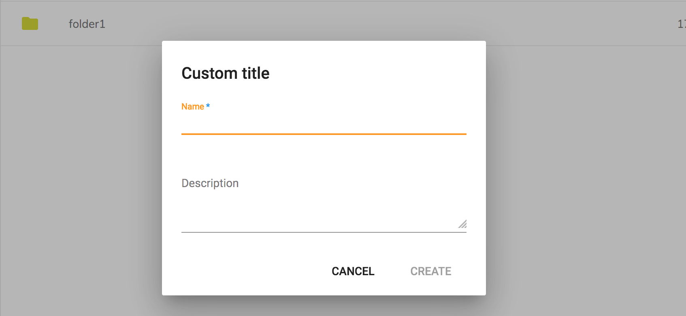

# Internationalization (i18n)

The Content Application provides support for the following languages:

- German (`de`)
- English (`en`)
- Spanish (`es`)
- French (`fr`)
- Italian (`it`)
- Japanese (`ja`)
- Norwegian (`nb`)
- Dutch (`nl`)
- Brazilian Portuguese (`pt-BR`)
- Russian (`ru`)
- Simplified Chinese (`zh-CN`)
- Arabic (`ar`)
- Czech (`cs`)
- Danish (`da`)
- Finnish (`fi`)
- Polish (`pl`)
- Swedish (`sv`)

The default language is English, however the current browser language is taken as the default one automatically when the application starts.

## User-defined language

You can allow users to set custom languages that are saved to their preferences.
The main application menu already has the [ADF Language Menu](https://www.alfresco.com/abn/adf/docs/core/components/language-menu.component/) component integrated and pre-filled with the supported items.

To change the default language set edit the `app.config.json` file and add or remove items:

```json
{
    "languages": [
        {
            "key": "de",
            "label": "German"
        },
        {
            "key": "en",
            "label": "English"
        },
        {
            "key": "es",
            "label": "Spanish"
        }
    ]
}
```

The file is located here: `/src/app.config.json`.

## Custom languages

To add a custom language, add a new "JSON" file to the "/src/assets/i18n" folder
with the name of the target language, for instance, a "de.json" for "German".

Translate the resource strings based on the default "en.json" file.
You can copy the content over to your newly created file and replace the English values with translated text.

```json
{
  "APP": {
    "SIGN_IN": "Anmelden",
    "SIGN_OUT": "Abmelden",
    "NEW_MENU": {
      "LABEL": "Neu",
      "MENU_ITEMS": {
        "CREATE_FOLDER": "Ordner erstellen",
        "UPLOAD_FILE": "Datei hochladen",
        "UPLOAD_FOLDER": "Ordner hochladen"
      }
    }
  }
}
```

The Content Application automatically bundles your file when the project builds.
You can test your locale by changing the browser language settings and reloading the page.

Optionally, you can extend the [ADF Language Menu](https://www.alfresco.com/abn/adf/docs/core/components/language-menu.component/) component with the newly added language by updating the `app.config.json` file.

## Customizing ADF translations

In addition to creating a custom language file for the Content Application,
you can also provide translations for the ADF resources.

Your `/src/assets/i18n/<lang>.json` file can reflect the structure of one of the ADF language files:

- ADF Core ([en.json](https://github.com/Alfresco/alfresco-ng2-components/blob/master/lib/core/i18n/en.json))
- ADF Content Services ([en.json](https://github.com/Alfresco/alfresco-ng2-components/blob/master/lib/content-services/i18n/en.json))
- ADF Process Services ([en.json](https://github.com/Alfresco/alfresco-ng2-components/blob/master/lib/process-services/i18n/en.json))
- ADF Insights ([en.json](https://github.com/Alfresco/alfresco-ng2-components/blob/master/lib/insights/i18n/en.json))

At runtime, the application-level strings have the highest priority.
That means you can replace the value of any ADF resource string if needed.

For example, let's change the title of the "Create Folder" dialog that was shipped with ADF.
Modify the `/src/assets/i18n/en.json` file and append the "CORE" section like in the example below:

```json
{
    "APP": {
    },
    "CORE": {
        "FOLDER_DIALOG": {
            "CREATE_FOLDER_TITLE": "Custom title"
        }
    }
}
```

Now, if you run the application and click the "New > Create Folder" menu,
the title of the dialog should look like the following:


