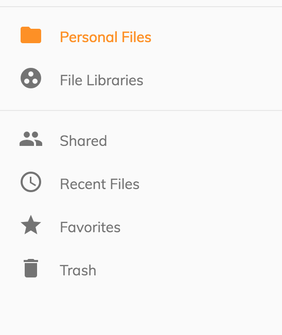
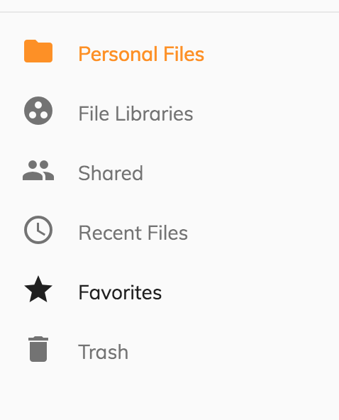
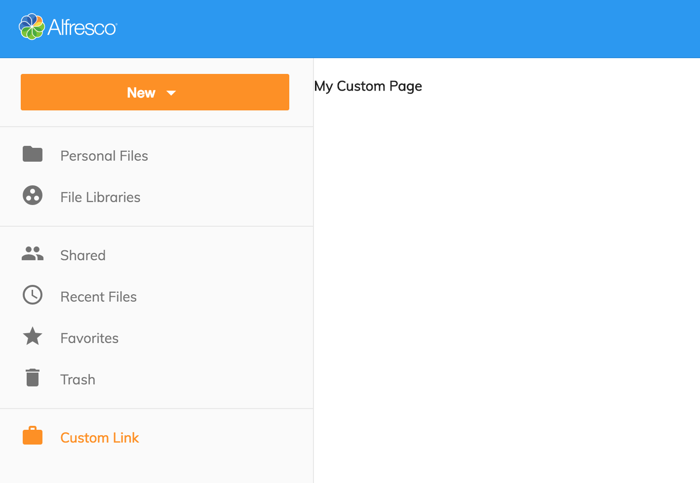

# Navigation

The Alfresco Content Application provides the following navigation links:

- Personal Files
- File Libraries
- Shared
- Recent Files
- Favorites
- Trash

The side navigation provides support to customize the appearance of the links by editing the `app.config.json`.

## Customization

Navigation configuration supports array and object like schema. Defining an object helps navigation to render visual delimiters between different groups of links.

```json
{
  "navigation": {
    "main": [],
    "secondary": []
  }
}
```



```json
{
  "navigation": [
    { },
    { }
  ]
}
```



### Customize icons and text

`icon` -  supported value can be anything from [Material Design](https://material.io/icons) icons library. If not defined, the link will render just the label value.

`title` - instructs the link to render a native browser tooltip with the given value. It can be a string or a i18n defined reference. If not defined, the link will not show a tooltip.

`label` - represents the visual name of the link. It can be a string or a i18n defined reference.

**Caution:** Changing ` "route": { "url": "/..." } ` value will affect the navigation since these are mapped to application routing system.

### Custom text (i18n)

To change the `title` and `label` of navigation links edit the values under `BROWSE` entry found at `/src/assets/i18n/en.json`

```json
{
  "APP": {
    "BROWSE": {
      "PERSONAL": {
        "TITLE": "Personal Files",
        "SIDENAV_LINK": {
          "LABEL": "Personal Files",
          "TOOLTIP": "View your Personal Files"
        }
      }
    }
  }
}
```

For more information about internationalization see [Internationalization (i18n)](/getting-started/internationalization) section.

## User-defined navigation

To add custom navigation link for the application, first we need to create a component.

`src/app/components/custom-page/custom-page.component.ts`

```js
import { Component } from '@angular/core';

@Component({
template: `
    <h4>{{ title }}</h4>
    `
})
export class CustomPage {
    title = 'My Custom Page'
}
```

Register the component in ```app.module.ts```

```javascript
import { CustomPage } from './components/custom-page/custom-page.component';

@NgModule({
  declarations: [
    CustomPage
  ]
})

```

In the `app.config.json` define a link entry which will point to the custom page

```json
{
  "navigation": [
      "main": [ ... ],
      "secondary": [ ... ],
      "custom": [
        {
          "icon": "work",
          "label": "Link",
          "title": "My custom link",
          "route": {
              "url": "/custom-route"
          }
        }
      ]
  ]
}
```

This can also be declared using ngrx store action:

```json
{
  "navigation": [
      "main": [ ... ],
      "secondary": [ ... ],
      "custom": [
        {
          "icon": "work",
          "label": "Link",
          "title": "My custom link",
          "click": {
              "action": "NAVIGATE_ROUTE",
              "payload": "custom-route"
          }
        }
      ]
  ]
}
```

Map the `/custom-route` in `app.routes.ts` as a child of `LayoutComponent` definition.

```js
import { CustomPage } from './components/custom-page/custom-page.component.ts';

export const APP_ROUTES: Routes = [
  {
    path: '',
    component: LayoutComponent,
    children: [
     {
        path: 'custom-route',
        component: CustomPage
      }
    ]
  }
]
```



### Rendering custom components

Navigation definition also supports custom components to be dynamically render. The schema for this is as follows:

```json
{
  "navbar": [
    {
      "id": "app.navbar.primary",
      "items": [
        {
          "id": "custom-component",
          "component": "custom-menu-item"
        }
      ]
    }
  ]
}
```

Navigation items or group of navigation items can be conditional render based on defined rules.

```json
{
  "navbar": [
    {
      "id": "custom-group-1",
      "rules": {
        "visible": "rule-reference-id"
      },
      "items": []
    },
    {
      "id": "custom-group-2",
      "items": [
        {
          "id": "itemId",
          "rules": {
            "visible": "rule-reference-id"
          }
        }
      ]
    }
  ]
}
```

For more information about rules checkout [Rules](../extending/rules.md) section.

For more information about the content of a custom page see [Document List Layout](/features/document-list-layout) section.
