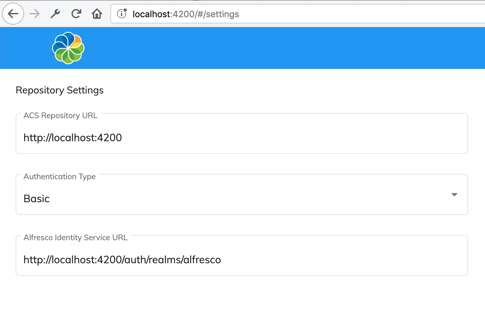

# Single Sign-On

Besides Basic Authentication, you can use Content Application with:

- [Keycloak](https://www.keycloak.org/)
- [Identity Service](https://docs.alfresco.com/identity1.0/concepts/identity-overview.html)
- Kerberos

The application contains reasonable defaults for Single Sign-On (aka SSO) setup.
You can find the settings in the `app.config.json` file, and they look similar to the following:

```json
{
  "providers": "ECM",
  "authType": "BASIC",
  "oauth2": {
    "host": "http://localhost:4200/auth/realms/alfresco",
    "clientId": "alfresco",
    "scope": "openid",
    "secret": "",
    "implicitFlow": true,
    "silentLogin": true,
    "redirectSilentIframeUri": "./assets/silent-refresh.html",
    "redirectUri": "/",
    "redirectUriLogout": "/logout"
  }
}
```

To switch from Basic Authentication to SSO mode, change the `authType` property value to `OAUTH`.
Also, the default configuration assumes you have an `alfresco` client pre-configured.

You can experiment with authentication modes on the http://localhost:4200/#/settings page:



## Kerberos

To enable support for the additional Kerberos features
please enable the `withCredentials` flag in the `app.config.json` file:

```json
{
  "auth": {
    "withCredentials": true
  }
}
```

Note that with the `withCredentials` flag enabled, the application is not going to redirect users to Login screen
as the login process is handled entirely by Kerberos.

## See also

For more details on the ADF Login component and configuration options please refer to the [Login](https://www.alfresco.com/abn/adf/docs/core/components/login.component/#single-sign-on-sso) documentation.
