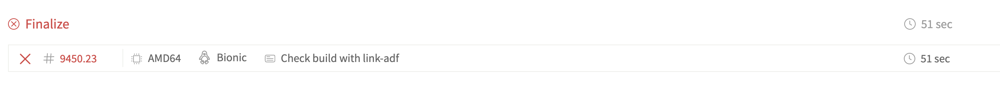
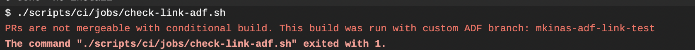

# Using Local ADF

If you are working with ADF source code and want to use the modified version with the ACA.

Clone the `alfresco-ng2-components` and `alfresco-content-app` repositories in the same folder, and run the following command:

```sh
npm start -- --configuration=adf
```

Changing the ADF code results in the recompilation and hot-reloading of the ACA application.

## Triggering the build to use specific branch of ADF with CI flags

You can create commits with the intention of running the build pipeline using a specific branch of ADF. To achieve this, you need to add a specific CI flag in your commit message:

```text
[link-adf:my-custom-branch-in-adf-repo]
```

So for example a commit message can be like:

```text
[link-adf:my-custom-branch-in-adf-repo] Adding XYZ features for the navigation header
```

When having this CI flag present in the commit message, the CI attempts to check out the given branch of ADF and use it when building / testing the applications.

### Important things to consider

- **This flag can only be used for PRs, not for any other type of builds**
- At the end of a PR build, there is a check which will make the build fail if you used this CI flag. This is there to make sure, only those PRs can be merged, which are using already merged in ADF features, **since this flag's only purpose is to be able to test whether the applications could be built with an experimental ADF feature or not**.

  This step is rendered in the `Finalize` stage

  

  with an error message

  
