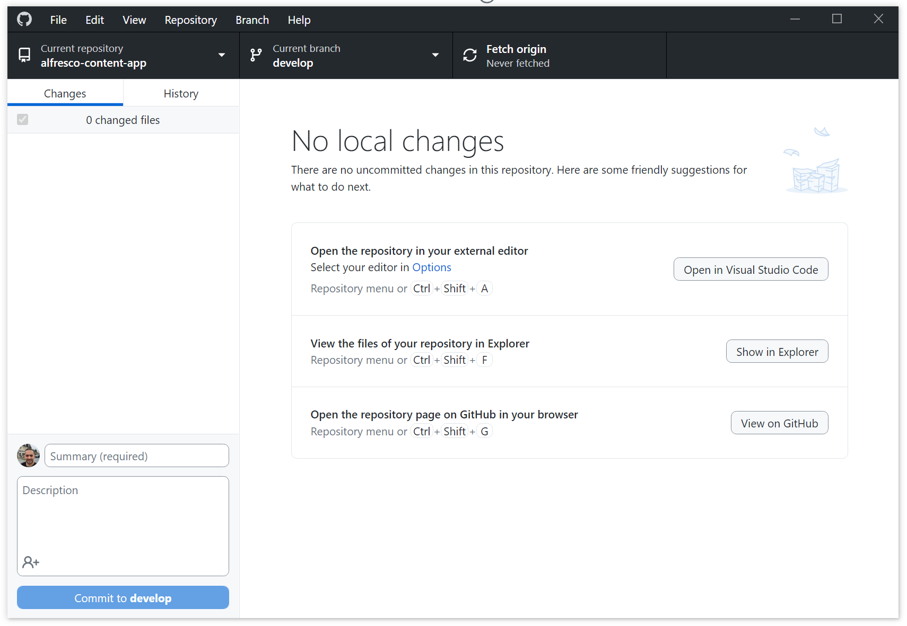
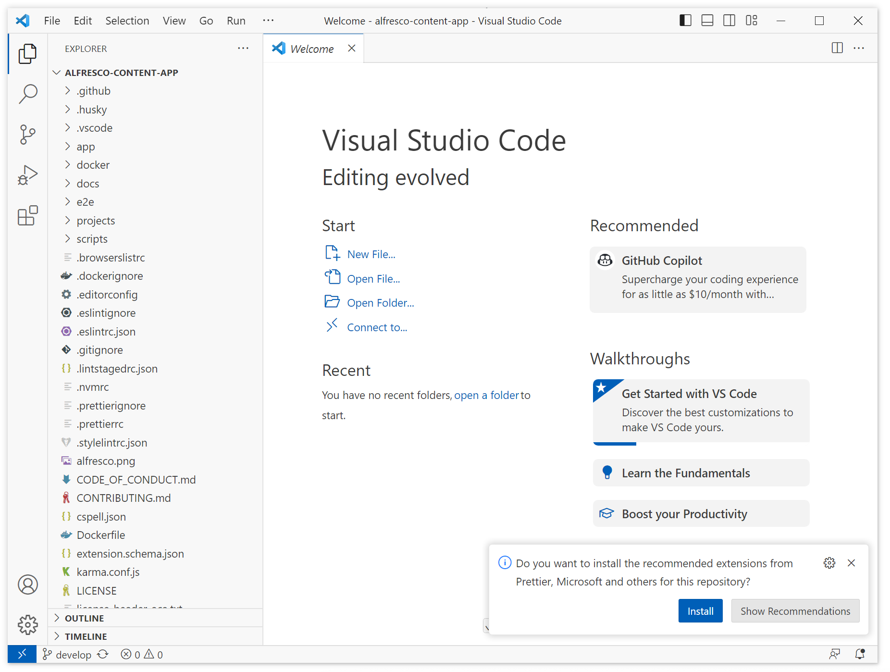
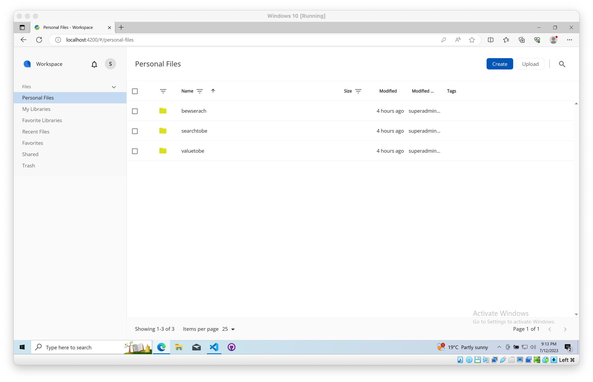

# Microsoft Windows

Learn how to get started with Microsoft Windows.

## Prerequisites

- [Windows 10 or later](https://www.microsoft.com/en-us/software-download/windows10ISO)
- [Microsoft Visual C++ 2015 Redistributable (x64)](https://aka.ms/vs/17/release/vc_redist.x64.exe)

## Install NodeJS on Windows

Follow the next guide to setup NVM, Node.js, VS Code and Git:  
<https://learn.microsoft.com/en-us/windows/dev-environment/javascript/nodejs-on-windows>

Configure NVM to use Node 18

```sh
nvm install 18
nvm use 18
```

## Setup GitHub Desktop (optional)

To simplify your work with GitHub it is recommended to install the GitHub Desktop tool:  
[GitHub Desktop | Simple collaboration from your desktop](https://desktop.github.com/)

## Clone Repository

Clone the repository using [GitHub Desktop](https://desktop.github.com/)



or with the command line:

```sh
git clone https://github.com/Alfresco/alfresco-content-app.git
cd alfresco-content-app
```

Click the "Open In Visual Studio Code" button or use your IDE of choice.

For VS Code, make sure you install all the recommended extensions coming with the repository:



## Setup

In the project root folder, create an `.env` file with the `BASE_URL` property pointing to your ACS backend.

```yaml
BASE_URL="https://your.acs.backend.com"
```

> This property is used for the proxy server to redirect all traffic during development process.

In the VS Code Terminal (powershell), install the Nx CLI:

```sh
npm install -g @nrwl/cli
```

## Build and Run

In the VS Code Terminal (powershell), run the following:

```sh
npm install
npm start
```

The application should open at `http://localhost:4200` by default.


