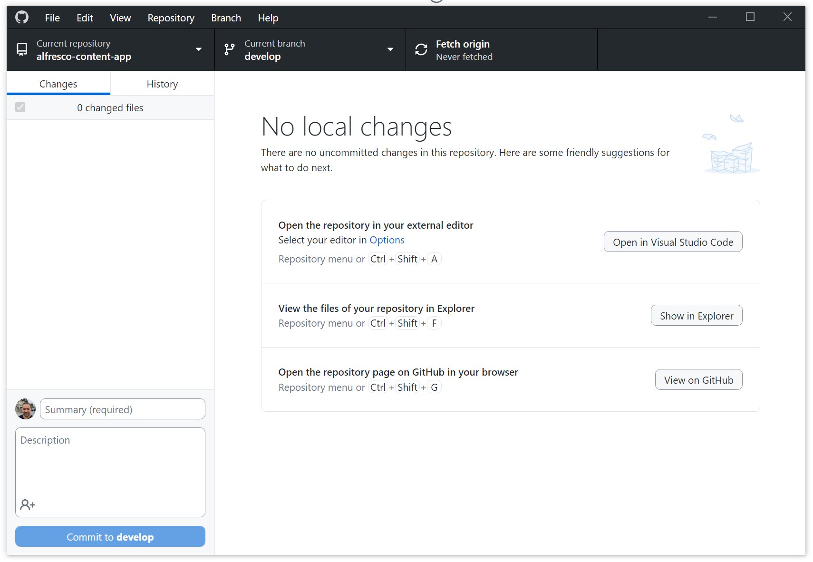
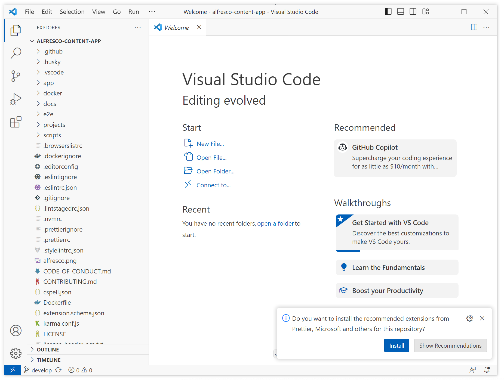
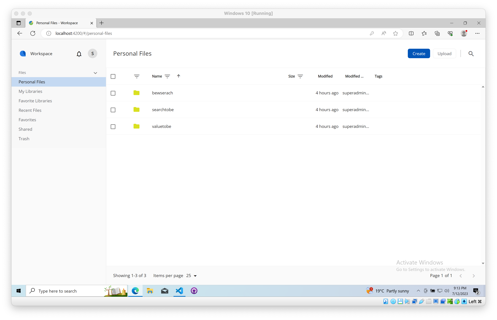

# Microsoft Windows

Learn how to get started with Microsoft Windows.

## Prerequisites

- [Windows 10 or later](https://www.microsoft.com/en-us/software-download/windows10ISO)
- [Microsoft Visual C++ 2015 Redistributable (x64)](https://aka.ms/vs/17/release/vc_redist.x64.exe)

## Install NodeJS on Windows

Follow the next guide to setup NVM, Node.js, VS Code and Git:  
<https://learn.microsoft.com/en-us/windows/dev-environment/javascript/nodejs-on-windows>

Configure NVM to use Node 18

```sh
nvm install 18
nvm use 18
```

## Setup GitHub Desktop (optional)

To simplify your work with GitHub it is recommended to install the GitHub Desktop tool:  
[GitHub Desktop | Simple collaboration from your desktop](https://desktop.github.com/)

## Use WSL and sign commits

If you work in [Windows Subsystem for Linux](https://learn.microsoft.com/en-us/windows/wsl/) and your repository requires signed commits, configure signing from your WSL shell.

### Option 1: SSH signing (recommended)

Generate an SSH key in WSL (if you do not already have one):

```sh
ssh-keygen -t ed25519 -C "your.email@example.com"
```

Add the public key to your GitHub account as a **Signing key**:  
<https://github.com/settings/keys>

Configure Git in WSL to sign all commits:

```sh
git config --global gpg.format ssh
git config --global user.signingkey ~/.ssh/id_ed25519.pub
git config --global commit.gpgsign true
```

Optional local signature verification:

```sh
mkdir -p ~/.config/git
printf "%s %s\n" "$(git config --global user.email)" "$(cat ~/.ssh/id_ed25519.pub)" > ~/.config/git/allowed_signers
git config --global gpg.ssh.allowedSignersFile ~/.config/git/allowed_signers
```

### Option 2: GPG signing

Install GPG in WSL:

```sh
sudo apt update
sudo apt install -y gnupg2 pinentry-curses
```

Generate a key and configure Git:

```sh
gpg --full-generate-key
gpg --list-secret-keys --keyid-format=long
git config --global gpg.program gpg
git config --global user.signingkey <KEY_ID>
git config --global commit.gpgsign true
```

Use terminal pinentry in WSL:

```sh
echo "pinentry-program /usr/bin/pinentry-curses" >> ~/.gnupg/gpg-agent.conf
gpgconf --kill gpg-agent
```

### Verify signed commits

Create a test commit and verify the signature:

```sh
git commit --allow-empty -m "test signed commit"
git log --show-signature -1
```

> Git settings are separate between Windows and WSL. Configure signing in each environment you use for commits.

## Clone Repository

Clone the repository using [GitHub Desktop](https://desktop.github.com/)



or with the command line:

```sh
git clone https://github.com/Alfresco/alfresco-content-app.git
cd alfresco-content-app
```

Click the "Open In Visual Studio Code" button or use your IDE of choice.

For VS Code, make sure you install all the recommended extensions coming with the repository:



## Setup

In the project root folder, create an `.env` file with the `BASE_URL` property pointing to your ACS backend.

```yaml
BASE_URL="https://your.acs.backend.com"
```

> This property is used for the proxy server to redirect all traffic during development process.

In the VS Code Terminal (powershell), install the Nx CLI:

```sh
npm install -g @nrwl/cli
```

## Build and Run

In the VS Code Terminal (powershell), run the following:

```sh
npm install
npm start
```

The application should open at `http://localhost:4200` by default.


