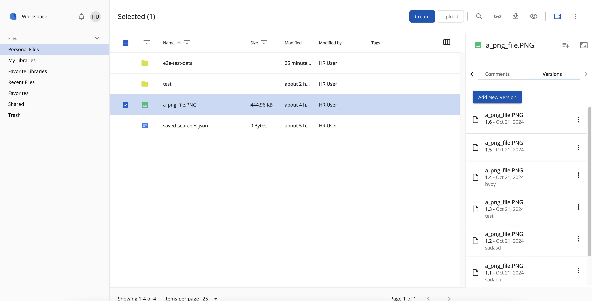

### Info Drawer

The Info Drawer displays node information in the right sidebar panel. It is created by using the [InfoDrawerComponent](https://alfresco.github.io/adf-component-catalog/components/InfoDrawerComponent.html). This info is available for both folder and file nodes.
 
Currently, there are 2 tabs available: Properties and Versions.

#### Properties tab

The Properties tab displays the node's metadata info by using the [ContentMetadataCardComponent](https://alfresco.github.io/adf-component-catalog/components/ContentMetadataCardComponent.html).

For more information, please check also the ADF's [ContentMetadataComponent](https://alfresco.github.io/adf-component-catalog/components/ContentMetadataComponent.html).

#### Versions tab

The Versions tab displays info about the node's versions and allows users to [manage versions](/version-manager), according to their permissions. Only the file nodes have version data available.

It uses the [VersionManagerComponent](https://alfresco.github.io/adf-component-catalog/components/VersionManagerComponent.html) from ADF framework.

Managing versions of a file can be possible also by accessing the 'Manage Versions' option from the 'More actions' menu. For more info on manage versions, please check the [version manager](/version-manager) page.
