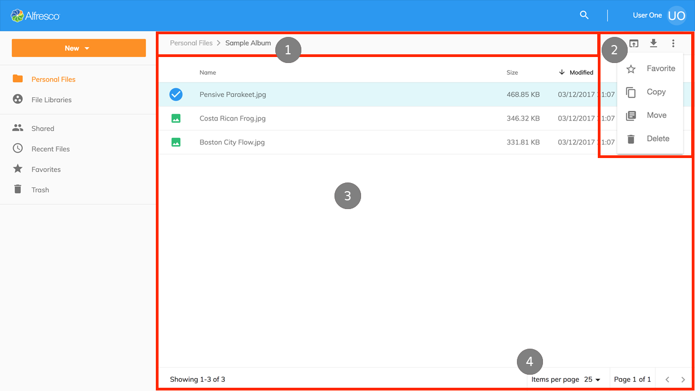

# 文書リストのレイアウト

アプリケーションのメイン領域は、いくつかの個別の ADF コンポーネントで構成されています:

1. [階層リンク](https://www.alfresco.com/abn/adf/docs/content-services/components/breadcrumb.component/)
2. [ツールバー](https://www.alfresco.com/abn/adf/docs/core/components/toolbar.component/)
3. [文書リスト](https://www.alfresco.com/abn/adf/docs/content-services/components/document-list.component/)
4. [ページネーション](https://www.alfresco.com/abn/adf/docs/core/components/pagination.component/)

アプリケーションには 7 つの異なる文書リストビューがあります。これらのビューは、各ビューの共通点と、ロードされるコンテンツに応じて微妙な違いを共有します。これについては以下で説明します。

## 個人用ファイル

個人用ファイルは、リポジトリ内のログインしているユーザーのホームエリア (`/User Homes/<username>/`) からすべてのコンテンツを取得します。
ユーザーがホームフォルダを持たない ‘admin’ の場合、リポジトリルートフォルダが表示されます。

個人用ファイルは、Nodes API を使用する
`Files` コンポーネントです。

## ファイルライブラリ

ファイルライブラリは、ユーザーが所属するすべてのサイトを取得します。
これには、公開、条件付き公開、非公開の種類のサイトが含まれます。
ファイルライブラリは、[Sites API](https://api-explorer.alfresco.com/api-explorer/#/sites) を使用する `Libraries` コンポーネントです。

ユーザーがサイトの1つを開くと、サイトの文書ライブラリのコンテンツが表示されます。
[Nodes API](https://api-explorer.alfresco.com/api-explorer/#/nodes) を使用して、
サイト (`/Sites/<siteid>/Document Library/`) の `Files` コンポーネントのファイルとフォルダを表示するために使用されます。

## 共有ファイル

共有ファイルビューは、コンテンツリポジトリの QuickShare 機能を使用して共有されたすべてのファイルを集約します。
`Shared Files` コンポーネントは、
[shared-links API](https://api-explorer.alfresco.com/api-explorer/#/shared-links) を使用し、
コンテンツリポジトリ内のファイルの場所と共有リンクの作成者を表示する追加の列を含みます。

## 最近使用したファイル

最近使用したファイルビューには、現在のユーザーが過去30日間に作成または変更したすべてのファイルが表示されます。
`Recent Files` コンポーネントは、
Search API を使用して、ユーザーが行った変更について SOLR を照会し、
コンテンツリポジトリ内のファイルの場所を表示する追加の列を含みます。

## お気に入り

お気に入りビューには、現在のユーザーがお気に入りとしてマークしたコンテンツリポジトリのすべてのファイルとフォルダが表示されます。
`Favorites` コンポーネントは、
[favorites](https://api-explorer.alfresco.com/api-explorer/#/favorites) を使用して
ユーザーのすべてのお気に入りノードを取得し、
コンテンツリポジトリ内のファイルの場所を表示する追加の列を含めます。

## ごみ箱

ごみ箱ビューには、ユーザーが削除したすべてのアイテムが表示され、管理者にはすべてのユーザーが削除したアイテムが表示されます。
このビューで利用可能な処理は、復元と完全に削除するです。
`Trashcan` コンポーネントは、[trashcan](https://api-explorer.alfresco.com/api-explorer/#/trashcan) API を使用して、
削除されたアイテムを取得し、ユーザーが要求した処理を実行します。
また、アイテムが削除される前にコンテンツリポジトリ内のどこにあったかを表示する追加の列も含まれています。

## 検索結果

検索結果ビューには、検索クエリで見つかったアイテムが表示されます。カスタムレイアウトテンプレートがあり、ユーザーは結果を簡単に参照し、アイテムに対して処理を実行できます。
`Search Component` コンポーネントの詳細については、この [検索結果](/features/search-results) セクションも確認してください。

別のカスタムテンプレートレイアウトは、ライブラリを検索するときに結果を表示するため、ユーザーはまだメンバーではないライブラリを検索、参加、およびお気に入りに追加できます。

## 処理と処理ツールバー

すべてのビューには、Alfresco Application Development Framework の
[toolbar](https://www.alfresco.com/abn/adf/docs/core/components/toolbar.component/) コンポーネントが組み込まれています。

アイテムが選択されるか、右クリックが実行されると、処理がツールバーに表示されます。ごみ箱ビューとは別に、現在のユーザーが必要な権限を持っている場合、すべてのユーザーには次の処理が表示されます。
ユーザーが権限を持たない場合、処理は自動的に非表示になります。

| 処理 | ファイル | フォルダ |
| -- | -- | -- |
| Microsoft Office で編集する | Word、PowerPoint、Excel ファイルを Microsoft Office アプリケーションで直接開きます。Alfresco Office Services が必要です | 使用できません |
| オフラインで編集 | ファイルをダウンロードし、オフライン編集のためにリポジトリにロックします | 使用できません |
| 新しいバージョンのアップロード | 選択したファイルの新しいバージョンをアップロードします | 使用できません |
| 共有 | 共有可能なファイルへのリンクを作成してコピーします。リンクにはファイルへのアクセス許可を付与せずにアクセスでき、ユーザーがアプリケーションにログインする必要はありません。共有リンクは日付に基づいて自動的に期限切れになる場合があります。最小有効期限は作成日から1日で、Content Services リポジトリによって制御されます。 | 使用できません |
| ダウンロード | 単一のファイルをユーザーのコンピューターにダウンロードします。複数のファイルが選択されている場合、それらは ZIP に圧縮されてからダウンロードされます。 | フォルダーは自動的に ZIP に圧縮され、ユーザーのコンピューターにダウンロードされます。 |
| 参照 | `Preview component` を使用して、選択したファイルを開きます。ファイルをブラウザでネイティブに表示できない場合、PDF レンディションがリポジトリから取得されます。 | 使用できません |
| 編集 | 使用できません | フォルダ名と説明はダイアログで編集できます。 |
| お気に入りに登録 | ファイルとフォルダのお気に入りマークのオンとオフを切り替えます。複数のアイテムが選択されていて、1つ以上がお気に入りではない場合、マークはオンに切り替わります。 |
| コピー | [Content node selector component](https://www.alfresco.com/abn/adf/docs/content-services/components/content-node-selector.component/)を使用して、ファイルとフォルダをコンテンツリポジトリの別の場所にコピーできます。コピー処理が完了するとユーザーに通知され、処理を元に戻すことができます (作成されたコピーが完全に削除されます)。 |
| 移動 | [Content node selector component](https://www.alfresco.com/abn/adf/docs/content-services/components/content-node-selector.component/) を使用して、ファイルとフォルダをコンテンツリポジトリ内の別の場所に移動できます。移動処理が完了すると、ユーザーに通知され、処理を元に戻すことができます (アイテムを元の場所に戻されます)。 |
| 削除 | ファイルとフォルダは、コンテンツリポジトリの配置されている場所から削除できます。削除処理が完了すると、ユーザーに通知され、処理を取り消すことができます (これにより、ごみ箱からアイテムが復元されます)。 |
| バージョンの管理 | バージョンマネージャダイアログを使用して、ファイルのバージョンを表示、アップロード、復元、ダウンロード、および削除できます。各処理が完了すると、変更に応じてバージョンのリストが更新されます。 | 使用できません |
| 権限 | ファイルのアクセス許可は、さまざまな方法で必要に応じて調整できます。親フォルダからの継承を無効にし、ユーザーまたはグループの役割を変更し、ユーザー/グループにアクセスを許可します。 | 利用できません |

ツールバーで利用可能な処理に加えて、ユーザーは次のことができます。
* シングルクリックでファイルを表示し、フォルダを開きます
* アイテムをクリックして選択します
* ファイルをダブルクリックして表示し、フォルダをダブルクリックして開きます
