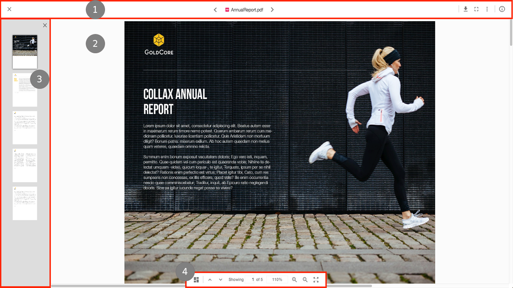

# ファイルビューア

ファイルビューアは、ADF の [ViewerComponent](https://www.alfresco.com/abn/adf/core/viewer.component/) を使用して作成されています。

ビューアには4つの主要な領域があります:

1. [ヘッダーとツールバー](#header-and-toolbar)
2. [コンテンツ](#content)
3. [サムネイルサイドペイン](#thumbnails-side-pane)
4. [ビューアコントロール](#viewer-controls)

## ヘッダーとツールバー

ビューアの[ヘッダーとツールバー]セクションには、現在表示されているファイルに関連する多くの機能が含まれています:

- 'X' で閉じると、ユーザーはファイルを含むフォルダに戻ります。
- 中央に名前とファイルの種類のアイコンが表示されます。
- ユーザーがビューアから移動せずにフォルダ内の他のファイルに移動できるように、ファイル名の両側に「次へ」ボタンと「前へ」ボタンが表示されます。
- 最後に、右側のアクションツールバーを使用すると、ユーザーはバージョンのダウンロード、お気に入り、移動、コピー、削除、管理、情報パネルの表示ができます。

## コンテンツ

ファイルビューアは、4つの独立したビューで構成されており、それぞれ4つのタイプのコンテンツに基づいてコンテンツを表示し、さまざまな [file/mime](https://www.alfresco.com/abn/adf/core/viewer.component/#supported-file-formats) タイプをカバーします:

- ドキュメントビュー: PDF ファイルは、他のドキュメントタイプ (DOCX など) のアプリケーションファイルビューアに表示され、PDF レンディションが自動的に取得されます
- 画像ビュー: JPEG、PNG、GIF、BMP、および SVG 画像は、アプリケーションのファイルビューアにネイティブに表示されます
- メディアビュー: MP4、MP3、WAV、OGG、および WEBM ファイルは、アプリケーションのファイルビューアでネイティブに再生されます。デフォルトでは、ファイルビューアはコンテンツをスムーズに再生できるように、一度に 50 MB のコンテンツをダウンロードします
- テキストビュー: TXT、XML、JS、HTML、JSON、および TS ファイルは、アプリケーションのファイルビューアにテキストとしてネイティブに表示されます

## サムネイルサイドペイン

ドキュメントビューにはサムネイルビューがあり、ビューアアクションツールバーのボタンでアクティブにできます。サムネイルをクリックすると、ユーザーは選択したページに直接移動し、ユーザーがドキュメントをスクロールすると、現在のページがペインで強調表示されます。

## ビューアコントロール

コンテンツの下部にあるビューアコントロールを使用すると、ユーザーはさまざまな方法でコンテンツを操作できます。利用可能なアクションは、表示されているコンテンツのタイプによって異なります。

- ドキュメントビュー:
  - Activate/Deactivate thumbnails pane
  - Previous/Next page
  - Jump to page number
  - Zoom in/out
  - Fit to page
  - Print
- 画像ビュー:
  - Zoom in/out
  - Rotate left/right (does not alter content in the repository)
  - Reset image
  - Print
- メディアビュー:
  - Play/pause
  - Timeline position
  - Toggle audio
  - Audio volume
  - Full screen
