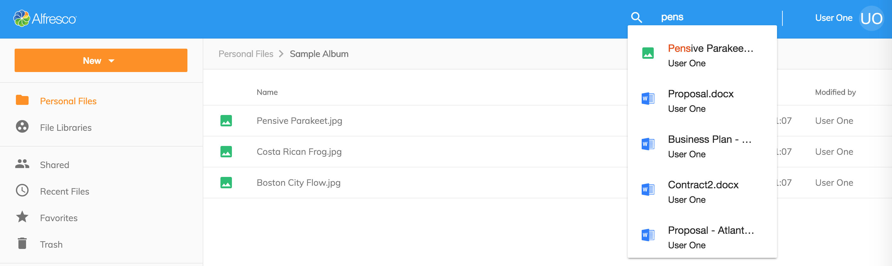
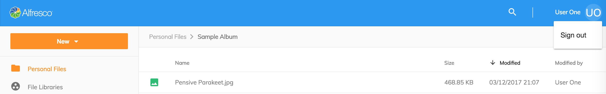

# ヘッダー

アプリケーションの `ヘッダー` には3つの主要な要素があります。

1. [ロゴと色](#ロゴと色)
2. [検索](#検索)
3. [現在のユーザ](#現在のユーザ)

## ロゴと色

ロゴとアプリの基調色 - ロゴと色は、プロジェクトのルートフォルダーにある
`app.config.json` ファイルを更新することで構成できます。
ロゴと色の変更方法の詳細については、[アプリケーション構成](/getting-started/configuration) のドキュメントを参照してください。

## 検索

アプリケーションの `検索` - [ADF Search Component](https://www.alfresco.com/abn/adf/docs/content-services/components/search.component/)を使用します。
このアプリは、ユーザーが Search API の結果から直接ファイルやフォルダーを開くことができる
'live' 検索機能を提供します。

テキスト入力エリアに `Enter` と入力すると、高度なフィルタリングとファセット検索を備えた
[検索結果](/features/search-results) ページが表示されます。

## 現在のユーザ

`現在のユーザ` -
ユーザーの名前と、ログアウトできるメニューを表示します。
オプションで `app.config.json` を更新することにより、
言語切り替えメニューを表示できます。

