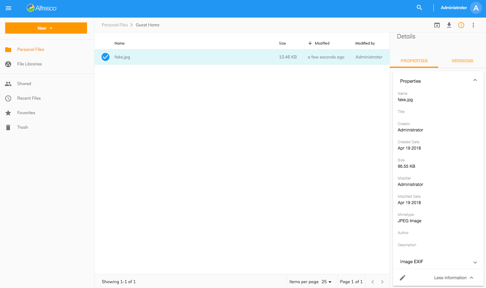

# 情報ドロワー

情報ドロワーの右側のサイドバーパネルにノード情報が表示されます。

[Info Drawer Component](https://www.alfresco.com/abn/adf/core/info-drawer.component/) を使用して作成されます。この情報は、フォルダノードとファイルノードの両方で使用できます。

現在、プロパティとバージョンの2つのタブを使用できます。

## プロパティタブ

プロパティタブには、[Content Metadata Card Component](https://www.alfresco.com/abn/adf/core/content-metadata-card.component/) を使用して、ノードのメタデータ情報が表示されます。

詳細については、[Content Metadata Component](https://www.alfresco.com/abn/adf/core/content-metadata.component/) も確認してください。

## コメントタブ

コメントタブには、[Comments Component](https://www.alfresco.com/abn/adf/core/comments.component/) を使用して、リポジトリで選択したノードに対して行われたすべてのコメントが表示されます。ユーザーは、すぐに表示される新しいコメントを投稿できます。
