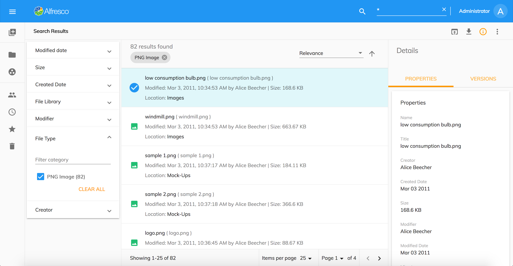

# 検索結果

検索入力コンポーネントにクエリを入力すると、アプリケーションはページに検索結果を返します。検索結果ページからファイルを開いて、選択したアイテムに使用可能な権限に応じてさまざまなアクションを実行できます。

このページは、次の ADF コンポーネントで構成されています:

- [Search Filter](https://www.alfresco.com/abn/adf/docs/content-services/components/search-filter.component/)
- [Search Chip List](https://www.alfresco.com/abn/adf/docs/content-services/components/search-chip-list.component/)
- [Search Sorting Picker](https://www.alfresco.com/abn/adf/docs/content-services/components/search-sorting-picker.component/)
- [Document List](https://www.alfresco.com/abn/adf/docs/content-services/components/document-list.component/) with custom layout template
- [Info Drawer](/features/info-drawer) with Metadata and [Version Management](#version-manager)
- [Toolbar with basic actions](/features/document-list-layout#actions-and-the-actions-toolbar) 例えば `Preview`, `Download`, `Favorite`, `Copy`, など

また、コピーおよび移動操作用の情報ドロワー、ツールバー、およびノードセレクターダイアログもあります。

## Alfresco 全文検索

次の表は、**検索入力**コンポーネントを使用する場合のコンテンツアプリケーションでの
[Alfresco 全文検索](http://docs.alfresco.com/6.1/concepts/rm-searchsyntax-intro.html) (FTS) 構文の
現在のサポートについて説明しています。

| 機能                                                          | フル | 部分的 | N/A | 詳細                                                                            |
| ---------------------------------------------------------------- | ---- | ------- | --- | ---------------------------------------------------------------------------------- |
| Search for a single term                                         | 1.6  |         |     | [Docs](https://docs.alfresco.com/6.0/concepts/rm-searchsyntax-single.html)         |
| Search for a phrase                                              |      | 1.7     |     | [Docs](https://docs.alfresco.com/6.0/concepts/rm-searchsyntax-phrase.html)         |
| Search for an exact term                                         | 1.7  |         |     | [Docs](https://docs.alfresco.com/6.0/concepts/rm-searchsyntax-exact.html)          |
| Search for term expansion                                        |      |         | X   | [Docs](https://docs.alfresco.com/6.0/concepts/rm-searchsyntax-term.html)           |
| Search for conjunctions                                          | 1.7  |         |     | [Docs](https://docs.alfresco.com/6.0/concepts/rm-searchsyntax-conjunct.html)       |
| Search for disjunctions                                          | 1.7  |         |     | [Docs](https://docs.alfresco.com/6.0/concepts/rm-searchsyntax-disjunct.html)       |
| Search for negation                                              |      |         | X   | [Docs](https://docs.alfresco.com/6.0/concepts/rm-searchsyntax-negate.html)         |
| Search for optional, mandatory, and excluded elements of a query |      |         | X   | [Docs](https://docs.alfresco.com/6.0/concepts/rm-searchsyntax-optional.html)       |
| Search in fields                                                 |      | 1.7     |     | [Docs](https://docs.alfresco.com/6.0/concepts/rm-searchsyntax-fields.html)         |
| Search for wildcards                                             |      | 1.7     |     | [Docs](https://docs.alfresco.com/6.0/concepts/rm-searchsyntax-wildcards.html)      |
| Search for ranges                                                |      |         | X   | [Docs](https://docs.alfresco.com/6.0/concepts/rm-searchsyntax-ranges.html)         |
| Search for fuzzy matching                                        |      |         | X   | [Docs](https://docs.alfresco.com/6.0/concepts/rm-searchsyntax-fuzzy.html)          |
| Search for proximity                                             |      |         | X   | [Docs](https://docs.alfresco.com/6.0/concepts/rm-searchsyntax-proximity.html)      |
| Search for boosts                                                |      |         | X   | [Docs](https://docs.alfresco.com/6.0/concepts/rm-searchsyntax-boosts.html)         |
| Search for grouping                                              |      |         | X   | [Docs](https://docs.alfresco.com/6.0/concepts/rm-searchsyntax-grouping.html)       |
| Search for spans and positions                                   |      |         | X   | [Docs](https://docs.alfresco.com/6.0/concepts/rm-searchsyntax-spans.html)          |
| Escaping characters                                              |      |         | X   | [Docs](https://docs.alfresco.com/6.0/concepts/rm-searchsyntax-escaping.html)       |
| Mixed FTS ID behavior                                            |      |         | X   | [Docs](https://docs.alfresco.com/6.0/concepts/rm-searchsyntax-ftsid.html)          |
| Search for operator precedence                                   |      |         | X   | [Docs](https://docs.alfresco.com/6.0/concepts/rm-searchsyntax-precedence.html)     |
| Search query templates                                           |      |         | X   | [Docs](https://docs.alfresco.com/6.0/concepts/rm-searchsyntax-querytemplates.html) |
| Search query literals                                            |      |         | X   | [Docs](https://docs.alfresco.com/6.0/concepts/rm-searchsyntax-literals.html)       |
| Search using date math                                           |      |         | X   | [Docs](https://docs.alfresco.com/6.0/concepts/rm-searchsyntax-datemaths.html)      |

> **部分的**なサポートとは、この機能が基本的なシナリオをサポートすることを意味し、
> まだ完全にはテストされておらず動作しない可能性があるエッジケースがあります。
