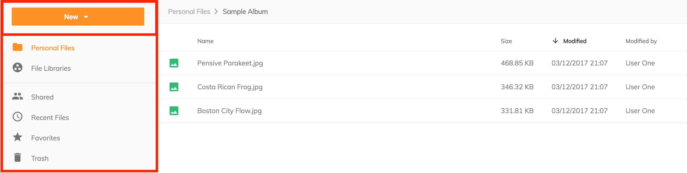
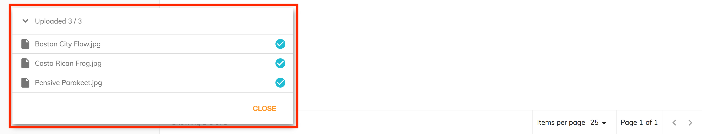

# サイドナビゲーション

アプリケーションの`サイドナビゲーション` には、ボタンメニューとナビゲーションリンクの2つの機能があります。

## New ボタン

New ボタンには、3つのアクションを提供するメニューが表示されます:

- Create a new folder - 新しいフォルダを作成するダイアログを提供します。フォルダ名は必須であり、説明はオプションです。
- Upload a file - OS のファイルブラウザを呼び出し、ユーザーが選択したファイルをコンテンツリポジトリの現在の場所にアップロードできるようにします。
- Upload a folder - OS のフォルダブラウザを起動し、ユーザーがコンテンツリポジトリの現在の場所にアップロードするフォルダーを選択できるようにします。

アップロードが開始されると、[upload component](https://www.alfresco.com/abn/adf/docs/content-services/components/file-uploading-dialog.component/) が表示され、開始したアップロードの進行状況がユーザーに表示されます。
アップロードダイアログは画面上に保持され、最小化できます。
ユーザーはアップロードの進行中もアプリケーションの使用を継続でき、アップロードをキャンセルして進行中のアップロードを停止したり、
既に完了したアップロードを完全に削除したりできます。

## ナビゲーション

ナビゲーションリンクは `app.config.json` を使用して構成できます。
デフォルト設定では2つのセクションが作成されます。
サイドナビゲーションの構成の詳細については、[ナビゲーション](/getting-started/navigation) を参照してください。
