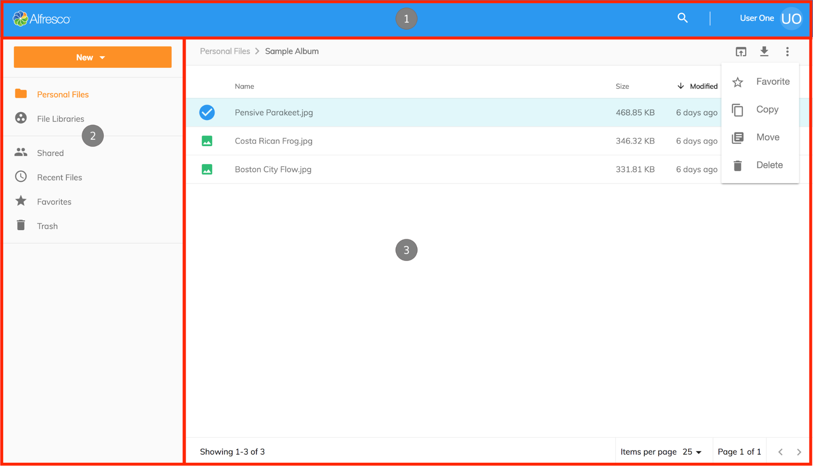

# ユーザーインターフェイス - レイアウト

`Layout component` によって制御されるアプリケーションの3つの主要な領域があります:

1. [アプリケーションヘッダー](/ja/features/header)
2. [サイドナビゲーション](/ja/features/side-navigation)
3. [ドキュメントリスト](/ja/features/document-list-layout)

