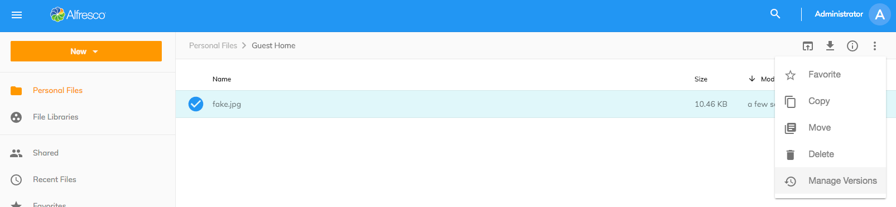
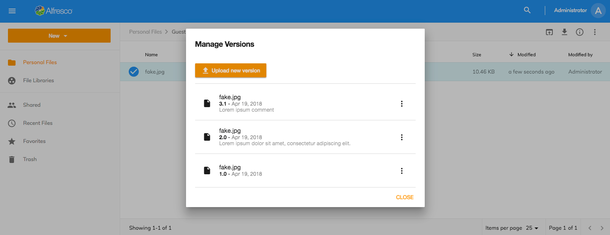
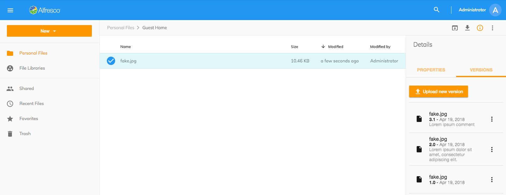

# バージョンマネージャ

ファイルのバージョンは、[Version Manager Component](https://www.alfresco.com/abn/adf/content-services/version-manager.component/) を使用して表示および管理できます。

ユーザーがバージョンマネージャにアクセスする方法は2つあります:

1) [その他のアクション] メニューの [バージョンの管理] オプションから ([アクションとアクションツールバー](/features/document-list-layout#actions-and-the-actions-toolbar)を確認します):




2) [情報ドロアー](/features/info-drawer) から (詳細右パネル):



## 新しいバージョンをアップロード

このボタンを使用して、選択したファイルの新しいバージョンを追加できます。ユーザーは、現在のバージョンと同じ名前または MIME タイプを持たないファイルを使用して新しいファイルバージョンをアップロードできます。ユーザーはバージョンのタイプ (マイナーまたはメジャー) を選択し、サポートコメントを入力できます。

[UploadVersionButtonComponent](https://www.alfresco.com/abn/adf/content-services/upload-version-button.component/) も確認してください。

## アクションメニュー

バージョンリストの各項目には、復元、ダウンロード、削除の2つのアクションがあります。これらは、ユーザーがその特定のアクションを実行する権限を持っている場合に表示されます。 「ダウンロード」と「削除」は app.config から無効にすることもできます。

app.config.json ファイルで、これらは ACA バージョンマネージャーの現在の設定です:

```json
{
   "adf-version-manager": {
       "allowComments": true,
       "allowDownload": true
   }
}
```

バージョンコメントをバージョンリストに表示しない場合は、allowComments を false に設定します。

ファイルのバージョンをクリックして削除すると、確認ダイアログが表示されます。詳細については、[Confirm Dialog Component](https://github.com/Alfresco/alfresco-ng2-components/blob/develop/lib/content-services/dialogs/confirm.dialog.ts) をご覧ください。
