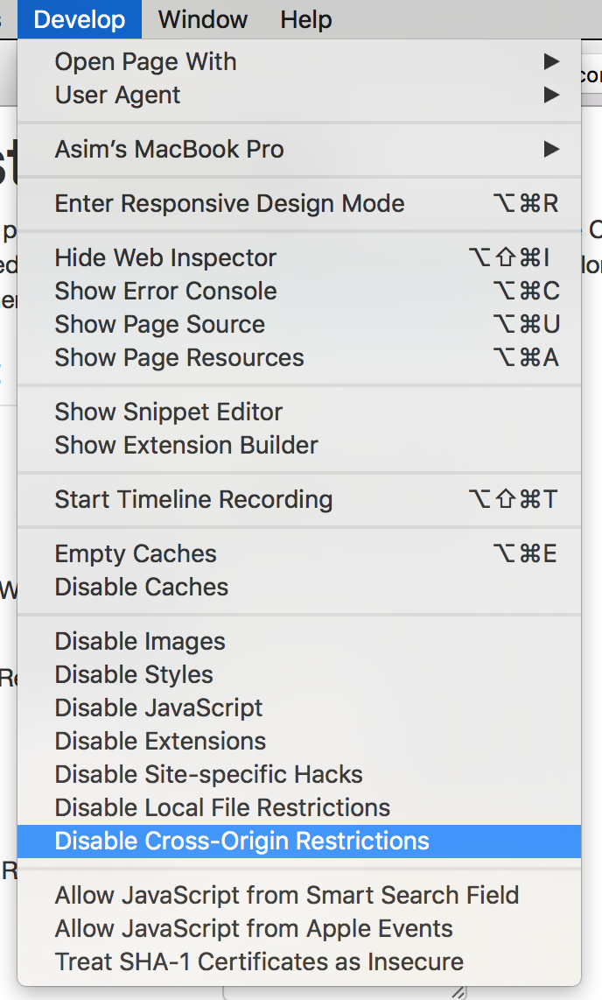

# CORS

Alfresco Content Application には、開発における CORS 関連の問題に対処するための Angular CLI のプロキシ設定が付属しています。

また、Docker イメージには、アプリケーションをローカルで開発およびデバッグするときに CORS に必要な Nginx 設定が含まれています。

## Chrome の回避策

Chrome ブラウザでは、CORS を切り替えることができる次のプラグインを使用できます:
[Allow-Control-Allow-Origin](https://chrome.google.com/webstore/detail/allow-control-allow-origi/nlfbmbojpeacfghkpbjhddihlkkiljbi)

## Firefox の回避策

Firefox ブラウザの場合、次のプラグインを使用できます: [CORS Everywhere](https://addons.mozilla.org/ja/firefox/addon/cors-everywhere/)

## Safari の回避策

Safari で開発やテストを行っている場合は、「開発」メニューを使用して CORS モードを切り替えることができます。
ただし、CORS の設定を変更するたびに、ページを再読み込みする必要があります。

## あわせて参照

- [CORS の使用](https://www.html5rocks.com/en/tutorials/cors/)
