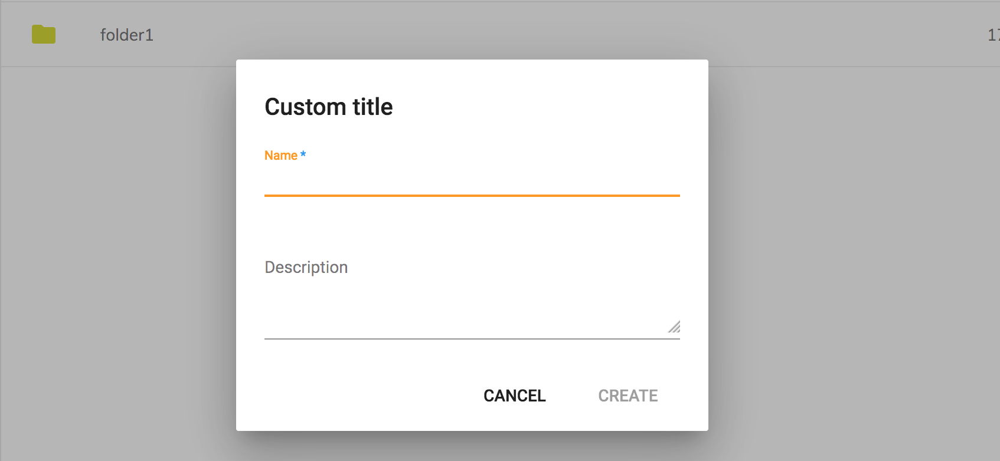

# 国際化 (i18n)

コンテンツアプリケーションは、次の言語のサポートを提供します:

- ドイツ語 (`de`)
- 英語 (`en`)
- スペイン語 (`es`)
- フランス語 (`fr`)
- イタリア語 (`it`)
- 日本語 (`ja`)
- ノルウェー語 (`nb`)
- オランダ語 (`nl`)
- ブラジルポルトガル語 (`pt-BR`)
- ロシア語 (`ru`)
- 簡体字中国語 (`zh-CN`)
- アラビア語 (`ar`)
- チェコ語 (`cs`)
- デンマーク語 (`da`)
- フィンランド語 (`fi`)
- ポーランド語 (`pl`)
- スウェーデン語 (`sv`)

デフォルトの言語は英語ですが、現在のブラウザの言語は、アプリケーションの起動時に自動的にデフォルトの言語として使用されます。

## ユーザ定義言語

ユーザが設定に保存されるカスタム言語を設定できるようにすることができます。
メインアプリケーションメニューには、すでに [ADF 言語メニュー](https://www.alfresco.com/abn/adf/docs/core/components/language-menu.component/) コンポーネントが統合され、サポートされる項目が事前に入力されています。

デフォルトの言語セットを変更するには、`app.config.json` ファイルを編集し、アイテムを追加または削除します:

```json
{
    "languages": [
        {
            "key": "de",
            "label": "ドイツ語"
        },
        {
            "key": "en",
            "label": "英語"
        },
        {
            "key": "es",
            "label": "スペイン語"
        }
    ]
}
```

ファイルは次の場所にあります: `/src/app.config.json`

## カスタム言語

カスタム言語を追加するには、新しい "JSON" ファイルを "/src/assets/i18n" フォルダに追加します。
たとえば、"ドイツ語" の "de.json" など、ターゲット言語の名前を指定します。

デフォルトの "en.json" ファイルに基づいてリソース文字列を翻訳します。
新しく作成したファイルにコンテンツをコピーし、英語の値を翻訳されたテキストに置き換えることができます。

```json
{
  "APP": {
    "SIGN_IN": "Anmelden",
    "SIGN_OUT": "Abmelden",
    "NEW_MENU": {
      "LABEL": "Neu",
      "MENU_ITEMS": {
        "CREATE_FOLDER": "Ordner erstellen",
        "UPLOAD_FILE": "Datei hochladen",
        "UPLOAD_FOLDER": "Ordner hochladen"
      }
    }
  }
}
```

Content Application は、プロジェクトのビルド時にファイルを自動的にバンドルします。
ブラウザの言語設定を変更してページを再読み込みすることにより、ロケールをテストできます。

オプションで、`app.config.json` ファイルを更新することにより、新しく追加された言語で [ADF 言語メニューコンポーネント](https://www.alfresco.com/abn/adf/docs/core/components/language-menu.component/) を拡張できます。

## ADF の翻訳のカスタマイズ

Content Application のカスタム言語ファイルを作成することに加えて、
ADF リソースの翻訳を提供することもできます。

`/src/assets/i18n/<lang>.json` ファイルは、ADF 言語ファイルの1つの構造を反映します:

- ADF Core ([en.json](https://github.com/Alfresco/alfresco-ng2-components/blob/master/lib/core/i18n/en.json))
- ADF Content Services ([en.json](https://github.com/Alfresco/alfresco-ng2-components/blob/master/lib/content-services/i18n/en.json))
- ADF Process Services ([en.json](https://github.com/Alfresco/alfresco-ng2-components/blob/master/lib/process-services/i18n/en.json))
- ADF Insights ([en.json](https://github.com/Alfresco/alfresco-ng2-components/blob/master/lib/insights/i18n/en.json))

実行時には、アプリケーションレベルの文字列が最も優先されます。
つまり、必要に応じて ADF リソース文字列の値を置き換えることができます。

たとえば、ADF に同梱されている "Create Folder" ダイアログのタイトルを変更してみましょう。
`/src/assets/i18n/en.json` ファイルを変更し、次の例のように "CORE" セクションを追加します:

```json
{
    "APP": {
    },
    "CORE": {
        "FOLDER_DIALOG": {
            "CREATE_FOLDER_TITLE": "Custom title"
        }
    }
}
```

ここで、アプリケーションを実行して "New > Create Folder" メニューをクリックすると、
ダイアログのタイトルは次のようになります:


