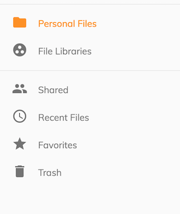
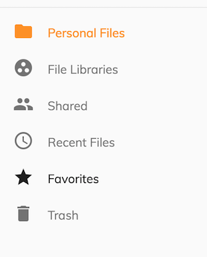
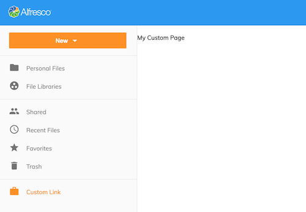

# ナビゲーション

 Alfresco Content Application は、次のナビゲーションリンクを提供します:

- 個人用ファイル
- ファイルライブラリ
- 共有
- 最近使用したファイル
- お気に入り
- ごみ箱

サイドナビゲーションは、`app.config.json` を編集してリンクの外観をカスタマイズするサポートを提供します。

## カスタマイズ

ナビゲーション設定は、スキーマのような配列とオブジェクトをサポートします。オブジェクトを定義すると、ナビゲーションがリンクの異なるグループ間の視覚的な区切り文字をレンダリングするのに役立ちます。

```json
{
  "navigation": {
    "main": [],
    "secondary": []
  }
}
```



```json
{
  "navigation": [
    {},
    {}
  ]
}
```



### アイコンとテキストをカスタマイズする

`icon` -  サポートされる値は、[Material Design](https://material.io/icons) アイコンライブラリの任意のものです。定義されていない場合、リンクはラベルの値のみをレンダリングします。

`title` - 指定された値でネイティブブラウザのツールチップをレンダリングするようにリンクに指示します。文字列または国際化定義の参照が可能です。定義されていない場合、リンクにはツールチップが表示されません。

`label` - リンクの視覚的な名前を表します。文字列または国際化定義の参照が可能です。

**注意:** ` "route": { "url": "/..." } ` の値を変更すると、これらはアプリケーションルーティングシステムにマッピングされるため、ナビゲーションに影響します。

### カスタムテキスト (i18n)

ナビゲーションリンクの `title` と `label` を変更するには、`/src/assets/i18n/en.json` にある `BROWSE` エントリの下の値を編集します

```json
{
  "APP": {
    "BROWSE": {
      "PERSONAL": {
        "TITLE": "Personal Files",
        "SIDENAV_LINK": {
          "LABEL": "Personal Files",
          "TOOLTIP": "View your Personal Files"
        }
      }
    }
  }
}
```

国際化の詳細については、[国際化 (i18n)](/ja/getting-started/internationalization) セクションを参照してください。

## ユーザー定義のナビゲーション

アプリケーションにカスタムナビゲーションリンクを追加するには、最初にコンポーネントを作成する必要があります。

`src/app/components/custom-page/custom-page.component.ts`

```js
import { Component } from '@angular/core';

@Component({
template: `
    <h4>{{ title }}</h4>
    `
})
export class CustomPage {
    title = 'My Custom Page'
}
```

コンポーネントを ```app.module.ts``` に登録します

```javascript
import { CustomPage } from './components/custom-page/custom-page.component';

@NgModule({
  declarations: [
    CustomPage
  ]
})
```

`app.config.json` で、カスタムページを指すリンクエントリを定義します

```json
{
  "navigation": [
      "main": [ ... ],
      "secondary": [ ... ],
      "custom": [
        {
          "icon": "work",
          "label": "Link",
          "title": "My custom link",
          "route": {
              "url": "/custom-route"
          }
        }
      ]
  ]
}
```

これは ngrx ストアアクションを使用して宣言することもできます:

```json
{
  "navigation": [
      "main": [ ... ],
      "secondary": [ ... ],
      "custom": [
        {
          "icon": "work",
          "label": "Link",
          "title": "My custom link",
          "click": {
              "action": "NAVIGATE_ROUTE",
              "payload": "custom-route"
          }
        }
      ]
  ]
}
```

`app.routes.ts` の `/custom-route` を `LayoutComponent` 定義の子コンポーネントとしてマッピングします。

```js
import { CustomPage } from './components/custom-page/custom-page.component.ts';

export const APP_ROUTES: Routes = [
  {
    path: '',
    component: LayoutComponent,
    children: [
     {
        path: 'custom-route',
        component: CustomPage
      }
    ]
  }
]
```



### カスタムコンポーネントのレンダリング

ナビゲーション定義は、動的にレンダリングされるカスタムコンポーネントもサポートします。このスキーマは次のとおりです:

```json
{
  "navbar": [
    {
      "id": "app.navbar.primary",
      "items": [
        {
          "id": "custom-component",
          "component": "custom-menu-item"
        }
      ]
    }
  ]
}
```

ナビゲーションアイテムやナビゲーションアイテムのグループは、定義されたルールに基づいて条件付きでレンダリングすることができます。

```json
{
  "navbar": [
    {
      "id": "custom-group-1",
      "rules": {
        "visible": "rule-reference-id"
      },
      "items": []
    },
    {
      "id": "custom-group-2",
      "items": [
        {
          "id": "itemId",
          "rules": {
            "visible": "rule-reference-id"
          }
        }
      ]
    }
  ]
}
```

ルールの詳細については、[ルール](../extending/rules.md) セクションを参照してください。

カスタムページのコンテンツの詳細については、[ドキュメントリストのレイアウト](/ja/features/document-list-layout) セクションを参照してください。
