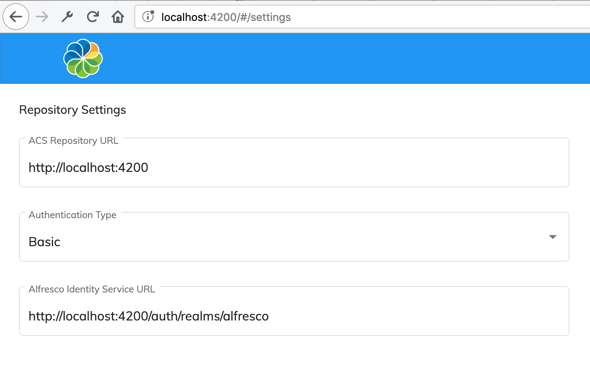

# シングルサインオン

Basic 認証に加えて、Content Application を以下で使用できます:

- [Keycloak](https://www.keycloak.org/)
- [Identity Service](https://docs.alfresco.com/identity1.0/concepts/identity-overview.html)
- Kerberos

アプリケーションには、シングルサインオン (別名 SSO) セットアップの適切なデフォルトの設定が含まれています。
設定は `app.config.json` ファイルの中にあり、次のようになります:

```json
{
  "providers": "ECM",
  "authType": "BASIC",
  "oauth2": {
    "host": "http://localhost:4200/auth/realms/alfresco",
    "clientId": "alfresco",
    "scope": "openid",
    "secret": "",
    "implicitFlow": true,
    "silentLogin": true,
    "redirectSilentIframeUri": "./assets/silent-refresh.html",
    "redirectUri": "/",
    "redirectUriLogout": "/logout"
  }
}
```

Basic 認証から SSO モードに切り替えるには、`authType` プロパティ値を `OAUTH` に変更します。
また、デフォルトの設定では、事前に設定された `alfresco` クライアントがあることを前提としています。

http://localhost:4200/#/settings ページで認証モードを試すことができます:



## Kerberos

追加の Kerberos 機能のサポートを有効にするには、
`app.config.json` ファイルで `withCredentials` フラグを有効にしてください:

```json
{
  "auth": {
    "withCredentials": true
  }
}
```

`withCredentials` フラグを有効にすると、ログインプロセスは完全に Kerberos によって処理されるため、
アプリケーションはユーザーをログイン画面にリダイレクトしません。

## あわせて参照

ADF Login コンポーネントと設定オプションの詳細については、[Login](https://www.alfresco.com/abn/adf/docs/core/components/login.component/#single-sign-on-sso) のドキュメントを参照してください。
