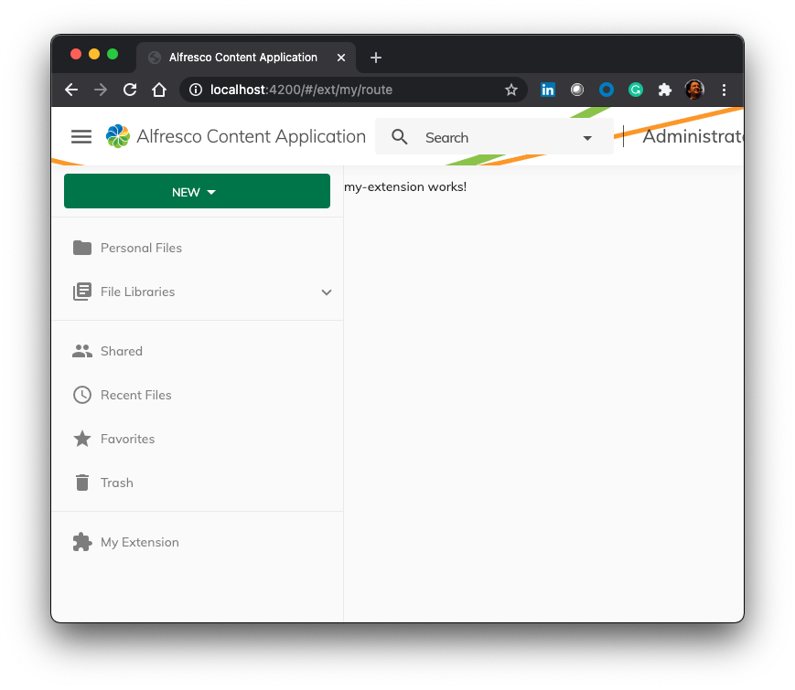

The purpose of this tutorial is to describe how to develop a “hello world” extension for the [Alfresco Content Application (aka ACA)](https://github.com/Alfresco/alfresco-content-app "https://github.com/Alfresco/alfresco-content-app"). The [ACA extension mechanism](https://alfresco-content-app.netlify.app/#/extending/ "https://alfresco-content-app.netlify.app/#/extending/") is the suggested way to customise the supported front-end application, and this tutorial is supposed to be the foundation for a content to share with customers and partners.

# Prerequisites

The starting point for this tutorial is the availability of the full repository of the [Alfresco Content Application (aka ACA)](https://github.com/Alfresco/alfresco-content-app "https://github.com/Alfresco/alfresco-content-app") on your development environment (your laptop as an example). This tutorial has been written with the following versions of the software:
-   ACA version 2.8.0,
-   ACS 7.1.1,
-   NodeJs version 12.22.10,
-   Chrome Version 87.0.4280.88.

# Creating the ACA extension

As described [here](https://github.com/Alfresco/alfresco-digital-workspace-app/blob/develop/docs/extending.md "https://github.com/Alfresco/alfresco-digital-workspace-app/blob/develop/docs/extending.md"), the creation of an ADW extension is straightforward following the [Nx Workspace](https://nx.dev/angular "https://nx.dev/angular") dev tools for monorepos.

From the root folder of the ACA project, launch the command below from a terminal. As you can see, with the command below you are going to create a new extension named `my-extension`.

    ng generate library my-extension

In case of errors, add the following line to the `tsconfig.json` file.  

    "compilerOptions": { "baseUrl": ".", "rootDir": "." }

Once done, in the `projects/my-extension` path you will find the following structure:

-   `src` folder containing all the typescript source code. Very important is the `public-api.ts` file defining all the inclusions of the extension and the `lib/my-extension.module.ts` file defining the module class for the extension.
    
-   README.md file for documentation purposes as well as other files used for testing and configuration.

To complete the creation, build the extension launching the following command.

    ng build my-extension

# Developing the basics of the ACA extension

Now that the `my-extension` is created, let's add the proper configuration to the extension module. For this purpose, edit the `projects/my-extension/src/lib/my-extension.module.ts` file changing what is described below.

```typescript
import { BrowserModule } from '@angular/platform-browser';
import { NgModule } from '@angular/core';
import { FormsModule } from '@angular/forms';
import { MaterialModule } from '@alfresco/adf-core';

import { ExtensionService, provideExtensionConfig } from '@alfresco/adf-extensions';
import { CoreModule, TRANSLATION_PROVIDER } from '@alfresco/adf-core';

import { MyExtensionComponent } from './my-extension.component';
import { MyExtensionService } from './my-extension.service';

export function components() {
    return [MyExtensionComponent];
}

@NgModule({
    imports: [CoreModule, BrowserModule, FormsModule, MaterialModule],
    providers: [
        {
            provide: TRANSLATION_PROVIDER,
            multi: true,
            useValue: {
                name: 'adf-my-extension',
                source: 'assets/adf-my-extension',
            },
        },
        MyExtensionService,
        provideExtensionConfig(['my-extension.json']),
    ],
    declarations: components(),
    exports: components(),
})
export class MyExtensionModule {
    constructor(extensions: ExtensionService, myService: MyExtensionService) {
        extensions.setComponents({
          'my-extension.main.component' : MyExtensionComponent,
        });
        extensions.setEvaluators({
           'my-extension.disabled': () => !myService.mySmartViewerEnabled(),
        });
    }
}
```

Since a new evaluator has been defined in the module, `mySmartViewerEnabled` method should be implemented in `projects/my-extension/src/lib/my-extension.service.ts` file.

```typescript
import { Injectable } from '@angular/core';

@Injectable({
  providedIn: 'root'
})
export class MyExtensionService {
  mySmartViewerEnabled() {
    return true;
  }

  constructor() { }
}
```

It's now time for the configuration of the brand new extension. For this purpose, you are going instruct the extension to add a link that you can see on the left menu of the landing page of ACA.

To create the proper configuration, create the folder below in the described path.

    projects/my-extension/assets

Once done, create the file `projects/my-extension/assets/my-extension.json` file with the following content.

```json
    {
      "$schema": "../../../extension.schema.json",
      "$id": "my-extension",
      "$version": "1.0.0",
      "$vendor": "Your name or company name",
      "$name": "plugin1",
      "$description": "demo plugin",
      "$license": "MIT",

      "routes": [
      {
        "id": "my.extension.route",
        "path": "ext/my/route",
        "component": "my-extension.main.component"
      }
    ],

      "features": {
        "navbar": [
          {
            "id": "my.extension.nav",
            "items": [
              {
                "id": "my.extension.main",
                "icon": "extension",
                "title": "My Extension",
                "route": "my.extension.route"
            }
          ]
        }
      ]
    }
    }

```

This is a very basic example, adding a “My Extension” item to the existing left menu, implementing a blank page containing “my-extension works!“ text appearing in the ACA landing page. From here, you can enrich the capabilities of your extension following the documentation at [https://alfresco-content-app.netlify.app/#/extending/](https://alfresco-content-app.netlify.app/#/extending/ "https://alfresco-content-app.netlify.app/#/extending/").

# Making the extension as part of the ACA application

Now that the ACA extension is developed in its initial version, let's add the extension module to the list of the ones used by the application. To complete the task, edit the `src/app/extensions.module.ts` file as described below.

```typescript
    // Add the following import to the page.
    import { MyExtensionModule } from 'my-extension';
    
    @NgModule({
      imports: [
        ...,
        MyExtensionModule
    ]
  })
  export class AppExtensionsModule {}
```

In addition, edit the `src/assets/app.extensions.json` file on the `$references` array. Below how it should look like.

    "$references": ["my-extension.json"],

Let's instruct the configuration file for the extension to be visible from the ACA app through a public URL. To complete the task, edit the `angular.json` file as described below.

    // Add to projects.content-ce.architect.build.options.assets array.
    ...
    {
      "glob": "my-extension.json",
      "input": "projects/my-extension/assets",
      "output": "./assets/plugins"
    },
    ...

Last but not least, edit the package.json file to allow the build of the extension, adding the following line to the scripts section.

    { ...
      "scripts": {
        ...,
        "build:my-extension": "ng build my-extension && npx cpr projects/my-extension/assets dist/my-extension/assets --deleteFirst"
    }, ...
  }

Once done, create the build of the extension running the following command.

    npm install my-extension

# Running ACA with the extension included

Now that everything is properly developed, it’s time to launch ADW and see the result. To launch ADW, run the following command from a terminal.

    npm start

What you should see is a new item in left menu of the landing page for ACA, implementing the route to a new page with the following content. Below the screenshot describing what it should look like.


