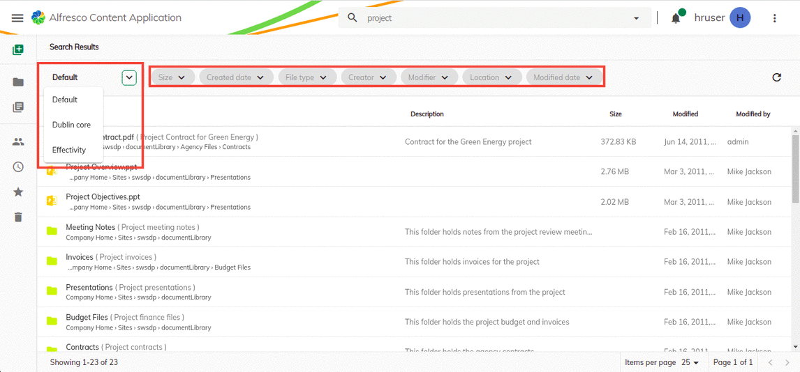

# Upgrade from v2.4.0 to v2.5.0

This guide explains how to upgrade your ACA v2.4.0 project to work with v2.5.0.

Do not skip this task, if you want your application to be updated to a most recent version of ACA. 
Upgrades of multiple versions of ACA cannot be done in one step only, but should follow the chain of sequential updates. 

**Note:** the steps described below might involve making changes
to your code. If you are working with a versioning system then you should
commit any changes you are currently working on. If you aren't using versioning
then be sure to make a backup copy of your project before going ahead with the
upgrade.

### Search Forms
We released a new feature called search forms. It would allow the user to set up numerous search configurations, and it could be extended from the extension. 

We moved the search object to [`app.extension.json`](https://github.com/Alfresco/alfresco-content-app/blob/v2.5.0/src/assets/app.extensions.json#L1181) from [`app.config.json`](https://github.com/Alfresco/alfresco-content-app/blob/v2.4.0/src/app.config.json#L192) in order to enable extendable search forms.

#### How to opt to this?
 If you don't have any search override, you can just remove the [`search`](https://github.com/Alfresco/alfresco-content-app/blob/v2.4.0/src/app.config.json#L192) configuration from app.config.json

#### What if search configuration is customised?
 The customised configuration should be moved to the custom extension own by you. [check here](/tutorials/search-form)
 
#### How can I know if search setup is customised?
 Just compare your app.config search object with [old configuration](https://github.com/Alfresco/alfresco-content-app/blob/v2.4.0/src/app.config.json#L192)
 
### See also
  - [How to extend The Search Form](/tutorials/search-form)
