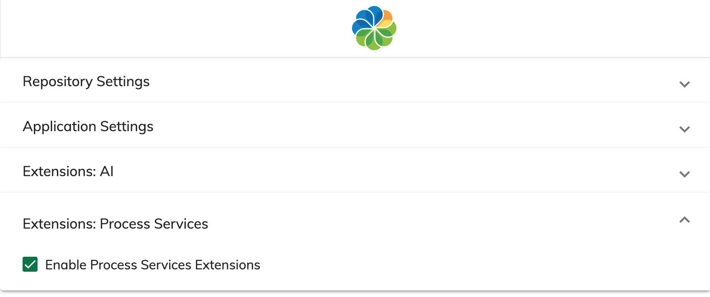

# Settings

The application settings can be accessed via the `/settings` route.

You can project custom configuration groups via the `settings` section:

```json
{
  "settings": [
    {
      "id": "extensions.ps.settings",
      "name": "Extensions: Process Services",
      "parameters": [
        {
          "name": "Enable Process Services Extensions",
          "key": "processServices",
          "type": "boolean",
          "value": false
        }
      ]
    }
  ]
}
```

At runtime, you are going to get an extra group called "Extensions: Process Services"
with a custom boolean setting "Enable Process Services Extensions".



## Parameters

Each setting parameter object supports the following properties:

| Property | Description                                     |
| -------- | ----------------------------------------------- |
| id       | (optional) Unique identifier                    |
| name     | Public name, can be translation key             |
| key      | The key to use when saving to the storage       |
| type     | The type of the value (boolean / string)        |
| value    | (optional) Default value to use for the setting |

# Installing

Import the module into the application:

```ts
// src/app/extensions.module.ts

import { AcaSettingsModule } from '@alfresco/aca-settings';

@NgModule({
  imports: [
    // other modules
    AcaSettingsModule
  ]
})
export class AppExtensionsModule {}
```

Update the `app.extensions.json` extension configuration to enable extra routes and components:

```json
{
  "actions": [
    {
      "id": "app.actions.settings",
      "type": "NAVIGATE_URL",
      "payload": "/settings"
    }
  ],

  "routes": [
    {
      "id": "app.settings",
      "path": "settings",
      "layout": "blank",
      "component": "app.settings.component"
    }
  ],

  "features": {
    "header": [
      {
        "id": "app.header.more",
        "children": [
          {
            "id": "app.header.settings",
            "order": 110,
            "title": "APP.SETTINGS.TITLE",
            "description": "APP.SETTINGS.TITLE",
            "icon": "info",
            "actions": {
              "click": "app.actions.settings"
            }
          }
        ]
      }
    ]
  }
}
```

Alternatively, you can use the `assets/settings.plugin.json` file.

Compile and distribute/run the application.
